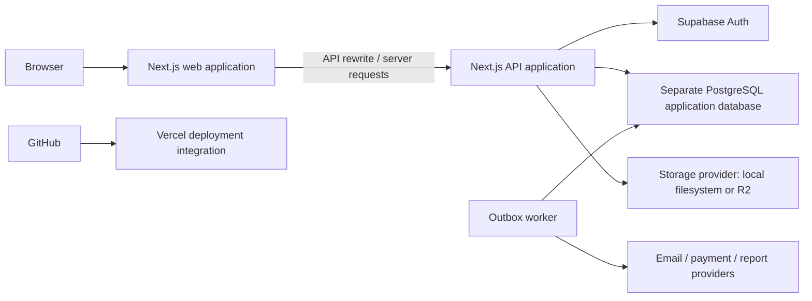

# Atlas LMS — comprehensive engineering and SaaS readiness audit

**Audit date:** 19 September 2026  
**Repository:** `VedantGit7/atlas-funded-lms` (private)  
**Audited checkout:** `ca8c0f1e7e69780b4e2ddc2a1136907a2e47c350`, branch `feat/security-hardening-p0p1-and-browser-suite`  
**Remote main observed:** `d15794708e6a2d0231286612e4bc573e92deb619`  
**Assessment:** substantial engineering foundations, but **not ready for a production-readiness sign-off** on the evidence available.

## 1. Executive assessment

Atlas already has several valuable controls: centralized authorization, transaction-scoped tenant context, enforced row-level security, storage isolation, schema validation, audit records, an outbox, and a large automated test suite. This audit verified meaningful parts of that foundation. The local database has **222 tenant-scoped tables; all 222 have RLS enabled and forced, and all have a tenant-leading index**. The application database login cannot bypass RLS. Fresh checks passed **2,215 tests across 303 files**, with one test skipped, and TypeScript checking passed.

Those results do not establish that the SaaS is secure or operationally ready. Several security controls have implementation gaps that their current tests do not detect. The most important are:

1. **MFA checks enrollment, not the current session's second-factor assurance.** A registered factor is not proof that this login completed MFA.
2. **Revoked platform access can return through environment configuration**, including automatic tenant-admin membership restoration.
3. **Idempotent retries can return a stored response without repeating authorization or matching its original actor.**
4. **Protected routes declare rate-limit policies without enforcing them in their shared wrappers.** The public limiter also catches a missing-production-Redis configuration error and falls back to per-process counters.
5. **Refunds and background deliveries do not have a sufficiently reliable external-side-effect lifecycle.** A gateway failure can still be recorded as a refund, and the generic outbox worker does not use its configured retry count.
6. **Deployment and release verification are not healthy.** GitHub records failed CI and Vercel deployment status for the audited commit. The intended LMS hostname redirects elsewhere. The committed release evidence fails its freshness and commit checks.

The recommendation is to close the release-blocking security and reliability findings, establish a working isolated staging deployment, then verify real learner/admin journeys and recovery under realistic conditions. Additional product features should follow that work.

This report contains **22 prioritized findings**, an efficiency plan, a service-by-service checklist, and concrete release acceptance criteria. It does not claim an exhaustive penetration test, legal compliance certification, or that every screen and every route was executed.

## 2. Scope, methods, and evidence limits

### What was examined

- The current local monorepo, with deeper review of authentication, tenant/platform route wrappers, database access, privileged roles, idempotency, rate limiting, outbound requests, storage, SCORM handling, refunds, exports/deletion, background delivery, monitoring configuration, and browser tests.
- Fresh offline tests, TypeScript checking, repository security/architecture guards, dependency vulnerability lookup, and an attempted full lint run whose incomplete status is recorded in the verification section.
- Read-only local PostgreSQL catalog queries and a no-tenant-context RLS visibility check. No customer records were exported.
- The connected Supabase project's metadata and security/performance advisors, plus read-only catalog inspection.
- GitHub repository metadata, remote main, branch/ruleset access, current commit checks/status, and recent workflow runs.
- Vercel connection discovery, project/deployment lookup attempts, and deployment status exposed through GitHub.
- Cloudflare-related source/configuration, public DNS, and a read-only HTTP header request to the documented production hostname.
- Current official guidance for Supabase MFA/RLS, Cloudflare R2, Vercel payload limits, GitHub workflows, and OWASP SSRF prevention.

### Important boundaries

| Area                 | Verified                                                                                                          | Not established                                                                                                         |
| -------------------- | ----------------------------------------------------------------------------------------------------------------- | ----------------------------------------------------------------------------------------------------------------------- |
| Source               | Findings apply to the audited checkout                                                                            | Local HEAD is different from remote main; neither is assumed to be deployed                                             |
| Application database | Local PostgreSQL 16.14, 234 public tables, 108 completed migrations                                               | Production application database host, backup configuration, HA and actual workload                                      |
| Supabase             | Project `rolumnldqjelwfvtmmqf`, healthy, region `ap-south-1`, PostgreSQL 17; auth use matches local configuration | Production auth redirect allowlist, SMTP delivery, MFA policies, session policy, provider setup                         |
| Supabase data plane  | No public LMS tables, public RLS policies, Atlas roles, or storage buckets were returned                          | Supabase performance advisor's empty result does **not** validate the separate LMS database                             |
| GitHub               | Current workflow failures and deployment status                                                                   | Complete effective branch protection: responses were inconsistent and the detailed endpoint denied integration access   |
| Vercel               | Failed deployment identified through GitHub                                                                       | Live project settings, environment values, runtime logs, region, protection and billing controls                        |
| Cloudflare           | Documented hostname resolves to Cloudflare and returns a redirect                                                 | Account WAF, cache rules, TLS mode, R2 bucket policies/CORS, DNS ownership and origin protection                        |
| User experience      | Browser test implementation and frontend boundary checks                                                          | Fresh authenticated browser journeys, visual quality, screen-reader behavior, mobile layout or measured Core Web Vitals |

The audit did not change application code, database schema/data, service settings, DNS, deployments, or repository policy. Only local audit artifacts and normal test/typecheck/lint outputs were produced. Offline tests ran with database connection variables removed because the existing global teardown can delete test-shaped tenants.

The dependency registry check was initially blocked by automatic approval review because dependency metadata would leave the machine. The user explicitly approved it; the lookup then completed. No source code, secrets, or customer records were submitted to the registry by that command.

## 3. Observed architecture and existing strengths

This diagram represents the source architecture. It is not a verified production topology. The documented public hostname currently does not lead to this application.

Controls worth preserving:

- `withTenantTx` applies `SET LOCAL ROLE atlas_app` and transaction-local tenant/request context, with statement and transaction timeouts.
- Local `atlas_app_login` is neither superuser nor `BYPASSRLS`. A direct membership count without tenant context returned zero.
- All 222 local tenant tables have forced RLS and a tenant-leading index. No invalid indexes were returned. All 21 inspected non-internal triggers were enabled. These are catalog checks, not full policy truth-table tests.
- Tenant routing resolves an active hostname/domain/tenant rather than trusting a client-supplied tenant ID.
- Shared tenant handlers enforce active membership, resource authorization, entitlements, and input/output schemas on normal execution.
- Session cookies are HTTP-only, secure in production mode, SameSite Lax, and host-scoped. Both tenant and platform wrappers include an Origin check for mutations.
- HTML rendering has a shared sanitization component; SCORM responses apply a sandbox CSP without `allow-same-origin`. ZIP expansion is capped before entry data is materialized.
- R2 support uses signed URLs and tenant-scoped object keys. Reviewed payment adapters include webhook signature validation.
- Transactional audit/outbox infrastructure, dead-letter operations, worker health plumbing, secret scanning, monitoring contracts, and local recovery/load harnesses exist.

## 4. Priority register

**P1:** close before production launch or before enabling the affected capability. **P2:** material hardening, correctness or efficiency work in the next delivery cycle. These are remediation priorities, not CVSS ratings. No production compromise was demonstrated.

**Evidence:** “reproduced” means a safe local probe of the relevant function; “source” means confirmed code behavior with production exploitation not exercised; “live” means an observed connected-service or network response; “conditional” depends on the final deployment architecture.

| ID  | Priority | Finding                                                                                    | Evidence                    | Suggested owner         |
| --- | -------- | ------------------------------------------------------------------------------------------ | --------------------------- | ----------------------- |
| F01 | P1       | MFA enrollment is used as session assurance                                                | Source + local probe        | Identity/security       |
| F02 | P1       | Platform revocation and tenant suspension can be overridden by environment grants          | Source                      | Identity/platform       |
| F03 | P1       | Idempotent replay is not actor-bound and bypasses current authorization                    | Source + local probe        | API/security            |
| F04 | P1       | Protected route rate limits are metadata only; public limiter degrades on missing config   | Source + local probe        | API/platform            |
| F05 | P1       | Missing `APP_ENV` permits development storage defaults in production mode                  | Local probe                 | Platform                |
| F06 | P1       | Outbound URL validation is not bound to the connection's resolved IP                       | Source                      | Security/backend        |
| F07 | P1       | Refund ledger can diverge from payment gateway outcome                                     | Source                      | Payments                |
| F08 | P1       | Outbox retries and external delivery recovery are incomplete                               | Source                      | Backend/platform        |
| F09 | P1       | CI is failing and release evidence is stale                                                | Live + executed guard       | DevOps                  |
| F10 | P1       | Effective main-branch protection is unproven/inconsistent                                  | Live                        | Repository owner        |
| F11 | P1       | Working deployment and complete hosting topology are not established                       | Live + source               | DevOps                  |
| F12 | P1       | Dependency scan includes a new high-severity runtime dependency advisory                   | Registry + source           | Backend/dependencies    |
| F13 | P2       | CSP defaults to Report-Only, with broad HTTPS allowances                                   | Source                      | Frontend/security       |
| F14 | P2       | Data-rights functionality is narrower than full erasure/portability                        | Source                      | Privacy/product/backend |
| F15 | P2       | Local export path can report success without storing the artifact                          | Source                      | Backend/storage         |
| F16 | P1       | Browser journey and isolation assertions are too shallow                                   | Source                      | QA/frontend             |
| F17 | P2       | Performance evidence does not establish production capacity                                | Source + recorded artifacts | Performance/platform    |
| F18 | P2       | Duplicated server implementation increases change and security drift risk                  | File comparison             | Architecture            |
| F19 | P2       | Supabase auth and function-grant hardening remain open                                     | Live advisor + catalog      | Identity/DB             |
| F20 | P2       | Global test teardown can apply destructive cleanup to any configured database              | Source                      | QA/platform             |
| F21 | P2       | Proctoring artifact table has no foreign keys                                              | Live local catalog          | Database                |
| F22 | P2       | Serverless execution is a poor fit for in-memory metering and long jobs without adaptation | Source; conditional         | Platform                |

## 5. Detailed findings and remediation

### F01 — Require session MFA assurance, not factor enrollment

**Remediation update, 19 September 2026:** implemented and locally verified in the working tree; see [F01 implementation and verification](D:/Projects/atlas-funded-lms/atlas-funded-lms/docs/engineering/f01-session-mfa-remediation.md). This includes MFA checks on cached retries. Deployment verification remains outstanding. The evidence below describes the original audited commit.

**Evidence:** [session.ts:58][S01] gets `listFactors()` and returns true when verified factors exist. [mfa-enforcement.ts:33][S02] permits access solely on `mfaEnabled`. The same flag reaches sensitive tenant routes. The local probe confirmed the guard accepts true without receiving any current-session AAL evidence.

**Impact:** an account with an enrolled authenticator can present a password-only session and satisfy this application gate. Enrollment verification and completing a challenge for this session are different facts. This is a source-confirmed authorization weakness; no real account was attacked.

**Fix:** validate the authenticated session's assurance level server-side and require `aal2` for platform access and sensitive tenant actions. Keep “has an enrolled factor” as a separate onboarding/UI field. Add challenge freshness for high-impact actions where appropriate. Supabase documents session assurance separately from factor enrollment. [Supabase MFA guidance](https://supabase.com/docs/guides/auth/auth-mfa).

**Acceptance:** the same operator with an enrolled factor is denied at AAL1 and allowed at AAL2; missing/invalid assurance fails closed; API calls cannot bypass the check by avoiding the UI. Estimated effort: 2–4 engineering days including auth journeys.

### F02 — Make revocation authoritative across all privilege paths

**Remediation update, 19 September 2026:** implemented and locally verified in the working tree; see [F02 implementation and verification](D:/Projects/atlas-funded-lms/atlas-funded-lms/docs/engineering/f02-platform-revocation-remediation.md). Runtime platform access now requires an active database grant, and automatic tenant-admin provisioning was removed. Deployment, approved operator bootstrap, and review of historical tenant-admin grants remain outstanding. Recovery uses controlled database administration; grant removal deadlines are operational, not automatically enforced. The evidence below describes the original audited commit.

**Evidence:** [platform-auth.ts:41][S03] falls back to `PLATFORM_OPERATOR_ASSIGNMENTS` when there is no active database grant. Revoked rows are excluded by the lookup, so revocation does not prevent fallback. [platform-super-admin-tenant-access.ts:22][S04] independently trusts the environment assignment; its membership upsert restores `ACTIVE` and clears suspension/removal timestamps.

**Impact:** database revocation can fail to revoke actual access. A suspended tenant-admin membership for an environment-listed platform super-admin can be restored on authentication/tenant access. The risk register's statement that looking in the database first prevents this is incorrect.

**Fix:** use one authoritative principal/privilege resolver; explicit revocation must override fallback. Restrict initial bootstrap to a one-time controlled operation. Any emergency access should be explicitly activated, time-limited, audited and subject to session MFA. Separate emergency recovery from normal request handling; do not silently restore tenant membership.

**Acceptance:** revoke database grant while leaving stale environment configuration, then verify denial on platform and tenant surfaces; suspension remains effective; emergency access expires. Effort: 2–4 days.

### F03 — Authorize every replay and bind it to the original actor

**Remediation update, 19 September 2026:** implemented and locally verified; see [F03 implementation and verification](D:/Projects/atlas-funded-lms/atlas-funded-lms/docs/engineering/f03-idempotency-remediation.md). Tenant retries now check current authorization and original actor/operation identity without repeating usage charges. Platform mutations use a separate transactional registry; unverifiable legacy provisioning retries conflict. Migration 107 is applied locally, and isolated Postgres concurrency/privilege tests passed. Production rollout and platform retention scheduling remain outstanding. The evidence below describes the original audited commit.

**Evidence:** [idempotency-registry.ts:113][S05] keys records by tenant and idempotency key. It stores the actor but does not compare it when returning the cached response at line 147. In [create-tenant-route.ts:345][S06], resource authorization, MFA and entitlement enforcement are inside the callback that replay bypasses. Active membership is checked before replay, but those other controls are not.

**Impact:** an active member who knows/reuses another member's key and matching request can receive that member's cached response. A caller whose permissions were reduced can also retrieve an old protected result. This does not establish cross-tenant access: the observed weakness is within a tenant. A mock-transaction probe returned member A's fixture response to a member B claim without invoking the protected handler.

**Fix:** separate authorization from the once-only mutation. Always authenticate and authorize the requested operation before replay. Scope replay to tenant, principal/membership, operation and key, and compare the request fingerprint. Enforce key size/retention policies. Separately, the platform wrapper checks key presence but has no equivalent generic replay registry; validate each platform mutation or add a suitable shared implementation.

**Acceptance:** a second member cannot replay another member's response; revoked permission/MFA/entitlement fails on replay; authorized retries do not repeat effects. Effort: 2–4 days.

### F04 — Enforce rate-limit declarations and distinguish outages from misconfiguration

**Remediation status (19 September 2026): implemented and verified locally; production rollout pending.** Tenant/platform limits now enforce actor/operation/tenant budgets; production startup requires Redis, outages fail closed with retryable 503, and throttles include `Retry-After`. Real Redis tests verified sharing, atomic increments and expiry. [Remediation and evidence](f04-rate-limiting-remediation.md) · [Rollout runbook](../runbooks/rate-limiting.md). Edge protection for unattributed requests, origin restrictions and outage-alert configuration remain deployment requirements; protected unknown-IP requests still use authenticated quotas but skip the pre-auth IP tier. The evidence below describes the original audited source.

**Evidence:** protected tenant/platform wrappers do not invoke the limiter despite declaring `rateLimit` metadata. The shared implementation is called by public routes. [rate-limit.ts:63][S07] catches all resolver/counter errors, including the intentional exception for missing Redis in production. A local probe reproduced a permitted public-auth request with `APP_ENV=production` and no Redis URL.

**Impact:** authenticated users can place disproportionate load on expensive reports, exports, assessment operations and writes. Missing distributed rate-limit configuration silently weakens public throttling across multiple instances.

**Fix:** apply centralized limits to authenticated and platform routes using tenant, actor and operation budgets. Add ingress protection before expensive auth/body/database work. Treat invalid startup configuration as fatal; handle temporary Redis outages with an explicit, monitored policy. Authentication/reset endpoints may warrant stricter degradation than ordinary reads. Return a real `Retry-After` header with 429 responses.

**Acceptance:** two instances share the same quota; a configured protected route actually returns 429 at its threshold; missing Redis configuration prevents production startup; an outage triggers the documented behavior and alert. Effort: 2–4 days.

### F05 — Validate deployment configuration before accepting traffic

**Remediation status (20 September 2026): implemented locally; production rollout and provider acceptance checks pending.** API/web instrumentation and worker startup now enforce one deployment contract, including persistent R2 storage, Redis, separate runtime database logins/TLS, origins, secrets, SMTP and monitoring. Deployment indicators cannot be masked by a development label. Lazy storage/email providers enforce deployed restrictions too. [Remediation and evidence](f05-deployment-configuration-remediation.md) · [Rollout runbook](../runbooks/deployment-configuration.md). Actual database grants, provider connectivity and an upload surviving instance replacement must still be verified in staging. The evidence below describes the original audited source.

**Evidence:** [storage-env.ts:4][S08] defaults to `local-fs` and a development signing secret. Production restrictions depend only on `APP_ENV`. A probe using `NODE_ENV=production` with absent `APP_ENV` returned `local-fs`. The inspected startup instrumentation initializes Sentry but does not validate these prerequisites.

**Impact:** a deploy missing a custom variable can accept local ephemeral storage or fail only on the first upload. Similar environment assumptions affect other infrastructure controls.

**Fix:** require an explicit validated application environment at startup; reject missing/unknown values in deployed runtimes. Validate storage, shared counters, separate database roles, canonical origins, signing keys, mail delivery, worker connectivity and monitoring configuration as one release contract. Keep deliberate test-mode configuration explicit.

**Acceptance:** missing production configuration fails readiness before traffic is served; a deployed upload survives restart; no development signing default is accepted. Effort: 1–3 days.

### F06 — Close the DNS validation/connection gap in SSRF protection

**Remediation status (20 September 2026): implemented locally; deployment and network egress rollout pending.** Tenant webhook requests now validate every returned DNS address, pin a fresh native HTTP/TLS connection to an approved address, preserve hostname verification, reject redirects/unsafe headers and enforce complete-operation deadlines and body/header limits. Added an optional exact hostname allowlist. [Remediation and evidence](f06-outbound-request-remediation.md) · [Operational runbook](../runbooks/outbound-webhooks.md). Controlled tests cover DNS changes, IPv6, mixed answers, real local TLS, slow/truncated/oversized responses and cancellation. Hosting-level egress restrictions and real provider staging checks remain release requirements. The evidence below describes the original audited source.

**Evidence:** [safe-outbound-fetch.ts:138][S09] checks one result from `lookup(..., {all:false})`, then calls ordinary `fetch(url)` at line 165. Fetch resolves the hostname again; the checked address is not bound to its socket.

**Impact:** a tenant-configured destination with changing/multiple DNS answers may pass validation and connect to an internal address. Exploitability depends on runtime DNS and network egress. No internal service was probed.

**Fix:** use a transport that validates and pins connection resolution, including IPv4/IPv6, while preserving TLS hostname checks. Add egress restrictions, destination allowlists where feasible, explicit deadlines, response-size limits and redirect handling. Validate all relevant resolved addresses. See [OWASP SSRF guidance](https://cheatsheetseries.owasp.org/cheatsheets/Server_Side_Request_Forgery_Prevention_Cheat_Sheet.html).

**Acceptance:** controlled tests cover DNS answer changes, mixed public/private records, IPv6, redirects, slow responses and oversized bodies. Effort: 2–4 days.

### F07 — Represent refunds as a durable financial workflow

**Remediation status — 20 September 2026:** implemented and verified locally. Refund requests now reserve balance in durable tenant-scoped intents; a leased worker submits outside database transactions using a stable provider key, then confirms or reconciles the outcome. Unknown outcomes remain reserved and are never blindly resubmitted. Signed callbacks only trigger ownership-checked reconciliation. Ledger/access effects require confirmed success; referenced manual adjustments and legacy records are labelled separately. Queue totals and refund history include pending reservations. [Implementation and evidence](f07-refund-workflow-remediation.md) · [Refund operations runbook](../runbooks/refunds.md). Migration, deployed-worker verification and provider test-mode acceptance remain rollout requirements. No live refund was executed. The evidence below describes the original audited source.

**Evidence:** [payments-roster.service.ts:1576][S10] calls the gateway within the request transaction, catches provider failure, then appends a refund and reduces the refundable balance. It can also revoke course access before gateway success. The Stripe adapter does not pass a provider idempotency key to `refunds.create`.

**Impact:** the LMS can record a refund that did not happen externally. Conversely, a provider success followed by local transaction failure can leave money movement without the corresponding ledger record. Retrying after that ambiguity can repeat an external call. No real payment or refund was executed.

**Fix:** record a refund intent with explicit states such as requested, processing, succeeded, failed and reconciliation-required. Serialize balance reservations for each payment, use a stable provider idempotency key where supported, and reconcile provider callbacks/results. Distinguish a manual ledger adjustment from a confirmed gateway refund. Apply course-access consequences according to an explicit business policy.

**Acceptance:** gateway timeout-after-success, duplicate request, concurrent partial refunds, database rollback and webhook replay each converge to one correct financial outcome. Effort: 4–7 days.

### F08 — Implement the retry contract and shorten delivery transactions

**Remediation status — 20 September 2026:** implemented and verified locally. Delivery jobs now persist leases, due times, retry budgets and destination-specific replay. External calls occur outside queue transactions; uncertain non-idempotent outcomes are held. Report recipients have separate durable receipts, workflow emails use child jobs, and export uploads run outside transactions. [Implementation and evidence](f08-outbox-retry-remediation.md) · [Delivery operations runbook](../runbooks/outbox-delivery.md). Migrations 109/110, deployed-worker verification and staging provider acceptance remain rollout requirements. No live external delivery was executed. The evidence below describes the original audited source.

**Evidence:** [outbox-worker.service.ts:25][S11] accepts `maxRetries` but never uses it. Any existing delivery record is skipped, including failed delivery. Failure creates a dead letter immediately with `retryCount:1`. Polling excludes events with a delivery record. Handlers are awaited while the poll transaction holds row locks; report routing explicitly wraps the batch in `withTenantTx`.

**Impact:** transient errors require manual replay instead of the advertised retry budget. External effects can finish before a transaction rollback loses the delivery record. Long handlers retain database connections/locks and can exhaust the pool; some handlers open further transactions.

**Fix:** claim work in a short transaction using a lease, execute external work outside it, then persist outcome in a separate short transaction. Persist attempts and `next_attempt_at`, use exponential backoff with jitter, classify permanent/transient errors, and dead-letter only after policy exhaustion. Use stable consumer/provider idempotency and destination-specific replay.

**Acceptance:** temporary failure succeeds after scheduled retries; persistent failure reaches DLQ only after the budget; crash after provider success does not duplicate the effect; multiple workers do not deliver the same leased work concurrently. Effort: 4–7 days.

### F09 — Restore trustworthy CI and release evidence

**Remediation update, 20 September 2026:** implemented and locally verified; see [F09 implementation and verification](D:/Projects/atlas-funded-lms/atlas-funded-lms/docs/engineering/f09-ci-release-evidence-remediation.md). Workflow admission defects, incomplete gating, and stale/invalid release evidence handling are repaired in the working tree. A full committed-candidate GitHub run and hosted negative-failure demonstration remain outstanding. The evidence below describes the original audit.

**Evidence:** [current-commit CI run](https://github.com/VedantGit7/atlas-funded-lms/actions/runs/35383359832) is failed and returned **zero jobs**. The associated drills workflow also failed. This is not evidence that its tests ran and failed. The exact GitHub validation/billing/dispatch reason was not exposed. `ci.yml:29` uses a custom top-level `x-generate-prisma-client` key; validate it against the [supported workflow schema](https://docs.github.com/en/actions/reference/workflows-and-actions/workflow-syntax), but do not assume this explains both workflows without their annotations.

The fresh release-evidence guard failed: the artifact is about 26.9 days old, describes `9872b623d897…`, and claims `READY_FOR_STAGING` for a different tree. The build job does not explicitly depend on `static-suite-tests`, despite that job containing structural/event tests.

**Fix:** resolve workflow admission failures, require a single aggregate check covering every required job, and publish fresh machine-generated evidence as a CI artifact for the candidate SHA. Do not manually change evidence to green. Pin action revisions and toolchain versions; preserve automatic update tooling. Correct stale CODEOWNERS paths to the current backend/frontend layout; the wildcard currently still assigns an owner.

**Acceptance:** a full candidate run actually executes all required jobs, fails on an intentionally failed security/event test, and produces matching fresh evidence. Effort: 1–3 days plus execution time.

### F10 — Verify and enforce repository protection

**Remediation update, 20 September 2026:** a reviewed-settings payload and rollout/exception procedure are prepared locally; see [F10 status and evidence](D:/Projects/atlas-funded-lms/atlas-funded-lms/docs/engineering/f10-repository-protection-remediation.md). Fresh reads still encounter the private-repository plan restriction and integration administration limit. Effective enforcement and the ordinary/admin rejection demonstration remain unverified, so F10 remains open. The evidence below describes the original audit.

**Evidence:** GitHub's branch response reported `protected:false` while also embedding `protection.enabled:true` and status-check enforcement for non-admins. The detailed protection endpoint returned “Resource not accessible by integration.” Rulesets returned a plan restriction requesting GitHub Pro or a public repository.

**Impact:** required review/check enforcement, especially for administrators, cannot be relied upon from these responses. This is an assurance gap, not a definitive claim that every protection is absent.

**Fix:** verify effective settings with repository administration access; require reviewed changes and the aggregate CI result on the release branch, restrict force push/deletion and document emergency bypass. Use a suitable private-repository plan if needed. Keep the repository private; making it public is not a security remediation.

**Acceptance:** demonstrate that a noncompliant test change cannot merge through normal or administrator paths without a separately audited exception. Effort: less than one day after access/plan resolution.

### F11 — Establish a working deployment and documented service boundaries

**Remediation update (2026-09-20):** actual Vercel install failure diagnosed and credential-free Prisma generation implemented locally; project root corrected live to `frontend/apps/web`. Authenticated tenant forwarding, platform Origin checks, OAuth cookie relay and release-health checks hardened with regression tests. **F11 remains open:** Vercel has no environment variables or working production deployment, the academy domain still redirects elsewhere, API/worker infrastructure is unverified, and the 15-minute report schedule is incompatible with the current Hobby plan. See [F11 report](f11-deployment-remediation.md) and [deployment runbook](../runbooks/deployment-topology.md).

**Evidence:** the documented hostname `academy.fundedbeyond.com` returned HTTP 302 to `https://fundedbeyond-com.l.ink/` at approximately 07:03 UTC on the audit date. GitHub's Vercel status for the audited SHA is failure and identifies [deployment Bs19QhQ6k3gEh5z6yJg6vB4ebEeY](https://vercel.com/vedantwedhane-8075s-projects/atlas-funded-lms/Bs19QhQ6k3gEh5z6yJg6vB4ebEeY).

The connected Vercel token could not access team `vedantwedhane-8075s-projects` (`team_LFRrS4VsrCp4yghJP4qrDo3k`). Project lookup also encountered a connector argument-mapping error; the build-log tool was unavailable server-side. No alternate healthy production deployment was established.

**Fix:** resolve the team connection and build failure; document where web, API, worker, database, Redis and storage run. Set `API_INTERNAL_URL` explicitly—source defaults to local port 3001. Validate frontend-to-backend hostname forwarding and platform Origin checks through the actual proxy chain. Protect previews and separate preview secrets/data from production. Configure cron authorization and verify schedules actually run against the API.

**Acceptance:** a candidate deployment serves the expected tenant on its custom domain, passes anonymous/authenticated smoke journeys, has a healthy worker, and identifies the deployed SHA. Effort depends on the current hosting setup; plan 2–5 days after access is restored.

### F12 — Patch current advisories, preserving reachability context

**Remediation update (2026-09-20):** all 12 unsuppressed entries were resolved through reviewed dependency patches and narrow overrides. The updated lockfile is installed locally; 2,336 regression tests passed across the main run and an isolated cache-access retry, and TypeScript passed. An unfiltered registry check still returns only the two existing `extract-zip` advisories covered by SEC-09; no new waiver was added. See [F12 remediation and evidence](f12-dependency-remediation.md). Changes are not yet deployed.

**Evidence:** the fresh registry audit returned 12 unsuppressed advisory entries: **one high and eleven moderate**. Its raw summary lists three high and eleven moderate because two existing `extract-zip` advisory IDs are excluded by workspace configuration. Do not describe these as three newly discovered high runtime vulnerabilities.

The new high entry is `adm-zip@0.6.0`, [GHSA-7q85-xj36-vmfc](https://github.com/advisories/GHSA-7q85-xj36-vmfc), patched in 0.6.1. It reaches the storage package. The application already checks declared entry sizes before `getData()`—25 MiB per entry, 250 MiB aggregate, 2,000 entries—so the advisory's unbounded-allocation example is constrained on the reviewed SCORM path. Keep those bounds and update the library; concurrent large packages still consume substantial memory. No destructive archive was executed.

Moderate entries include `adm-zip` symlink extraction, `fflate` in two dependency lines, `qs`, Vitest/mocker, baseline-browser-mapping and Hono. Package classification does not by itself prove a vulnerable function is shipped or reachable; for example, the reviewed ZIP code reads buffers rather than extracting through the advisory's filesystem API.

**Fix:** update compatible parent/direct dependencies, refresh the lockfile, retest SCORM and uploads, and review exceptions against current releases. Use the exact ranges and paths in the saved audit JSON. Keep development/build-tool risk separate from deployed runtime risk. Effort: 1–3 days.

### F13 — Finish CSP enforcement without breaking learning content

**Remediation update (2026-09-20):** local implementation now has per-request script nonces, explicit provider origins, bounded violation collection with an isolated rate-limit budget, and narrow framing exceptions that preserve SCORM's enforced opaque sandbox. Browser fixture checks prove injected inline scripts/event handlers are blocked while trusted nonced scripts run. Default enforcement remains deferred pending a working F11 candidate and authenticated learning/admin/provider acceptance; SCORM progress bridging and certificate embedding are known pre-existing acceptance gaps. SEC-01 remains open. See [F13 implementation and evidence](f13-csp-remediation.md) and the [rollout runbook](../runbooks/content-security-policy.md).

**Evidence:** [security-headers.mjs:46][S12] chooses Report-Only unless `CSP_ENFORCE=1`; connect/frame/media/image policies allow broad HTTPS destinations. The theme initializer uses an inline script. No report collection destination is present in the shared policy. Existing sanitization remains a useful first defense.

**Fix:** adopt nonce/hash handling for necessary scripts, inventory legitimate providers, collect violations, narrow directives and enforce incrementally. Test SCORM's separate sandbox policy together with global `X-Frame-Options`/framing headers, video, OAuth and proctoring. Do not turn on the current restrictive script policy blindly.

**Acceptance:** learning/admin/auth flows work under enforced policy; injected script is blocked; violation reporting is actionable. Effort: 2–4 days.

### F14 — Define and complete the privacy lifecycle

**Remediation update (2026-09-20):** partially remediated locally. Access removal now records its actual outcome and retained categories, preserves shared identities and unknown historical outcomes, and commits evidence atomically. UI/help/export manifests describe actual scope instead of promising complete erasure/export. The requested policy check found no approved cross-domain schedule or implemented legal holds. Comprehensive erasure, full subject exports, provider/backup handling and full acceptance remain open. See [F14 report](f14-privacy-lifecycle-remediation.md), [data inventory](f14-data-inventory.md) and [privacy runbook](../runbooks/privacy-lifecycle.md).

**Evidence:** [data-rights-deletion-processor.ts:24][S13] removes membership and marks the request successful. Membership removal changes status/timestamps; it does not erase profile, assessment, media or global auth identity data. The export contract explicitly covers only membership, profile, course and enrollment data.

**Impact:** membership offboarding is narrower than comprehensive erasure; this export is narrower than a complete personal-data export. This is a capability/promise alignment finding, not a legal determination that every retained record must be deleted.

**Fix:** document a data inventory and retention/legal-hold rules per domain. Separate access removal from deletion/anonymization and distinguish tenant membership from a global identity shared by other tenants. Cover uploads/proctoring, analytics, search indexes, provider data and backup expiry where applicable. Make UI completion messages accurately describe the achieved scope.

**Acceptance:** representative data is removed/anonymized or explicitly retained with a recorded reason; other tenants' legitimate memberships remain intact; the user receives an accurate export/deletion outcome. Effort: product/legal scoping followed by roughly 5–10 engineering days.

### F15 — Store and verify exports for every supported provider

**Remediation update (2026-09-20):** implemented locally with bounded tenant-export generation, streaming provider writes and SHA-256 readback, verified download gates, separate file/link expiry, and durable physical cleanup. Report retention and cleanup paths also corrected. Database rollout and live R2 staging acceptance remain pending; fixture tests are not live-cloud evidence. See [F15 report](f15-export-storage-remediation.md) and [export runbook](../runbooks/export-lifecycle.md).

**Evidence:** [data-rights-export-runner.ts:40][S14] uploads bytes only for the R2 branch, but returns an object key/expiry for all providers. The worker can then mark the job successful. The local filesystem provider is the default in development.

**Fix:** use the provider's object-write abstraction for both R2 and local storage. Verify metadata/checksum before marking success. Separate artifact retention from signed-link TTL. Stream/chunk large exports rather than buffering an unbounded tenant snapshot.

**Acceptance:** run the same export/download/content-check contract against local storage and R2; failed writes never produce a successful downloadable export. Effort: 1–2 days.

### F16 — Test user outcomes and denial, not only rendered shells

**Remediation update, 20 September 2026:** seven stateful browser journeys, guarded local fixtures with real MFA, Linux screenshot comparisons, and seven deliberate-failure probes are implemented. The probes passed locally, and the critical journeys have been exercised against isolated services. See [F16 implementation and verification](f16-browser-outcomes-remediation.md) for exact results and coverage limits. Hosted CI and production verification remain outstanding. The evidence below describes the original audited source.

**Evidence:** `tests/browser/journeys/03-learner-assessment.spec.ts` visits `/courses` and asserts a visible main element. The platform provisioning journey loads `/platform` without provisioning. The cross-tenant negative test checks that the two page hostnames differ, not that tenant B data/actions are inaccessible. CI disables visual comparisons with `BROWSER_E2E_SKIP_VISUAL=1` because the stored baselines are Windows-specific.

**Fix:** keep shell smoke tests but name them accurately. Add real stateful journeys: enroll/resume/complete, assessment autosave-submit-grade, instructor draft-review-publish, role grant/revoke, platform provisioning, and cross-tenant object denial across read/update/delete/download. Assert resulting database/API state and user-visible outcomes. Generate baselines on the CI platform and exercise keyboard/focus behavior through completion.

**Acceptance:** each critical journey fails when its underlying permission, persistence or outcome is intentionally broken. Isolation tests assert denial and absence of foreign data, not just different URLs. Effort: 5–10 days for the first meaningful critical-path suite.

### F17 — Measure the complete path before sizing production

**Remediation update, 20 September 2026:** guarded authenticated HTTP/mobile measurements, pool timing, cross-process connection budgets and stricter bundle evidence are implemented locally. Deferring the logout-only browser SDK reduced the home route from 412.3 to 354.0 kB gzip; the largest remaining learner route is 404.2 kB. See [F17 implementation, measurements and remaining acceptance](f17-performance-measurement-remediation.md). The initial test target is 100 active learners with a burst to 200. Production-shaped staging capacity and the 150 kB target remain unverified/unmet. The evidence below describes the original audited source.

**Evidence:** the recorded bundle baseline is 422.1 kB gzip on the worst learner route versus a 150 kB target; this was not freshly rebuilt in this audit. The saved load result is local, four seconds per level, and excludes HTTP/auth. The saved 9.22-second restore is also local, with 231 tables, while the current database has 234. Authenticated tenant requests may make multiple Supabase calls and upsert a principal on each request. The tenant/platform pools default to 20/10 connections per process.

**Fix:** measure full requests and user journeys on production-shaped staging; budget the total across web/API/workers and instances. Reduce repeated session/factor/profile work with carefully scoped caching that preserves revocation. Consolidate shell queries, use keyset pagination, move large reports off request paths, and profile SQL before adding indexes. Split client-heavy learner components and load optional editors/charts/media only when needed.

**Acceptance:** measure p50/p95/p99, errors, pool wait, query timings and worker lag at target concurrency and a burst above it; measure mobile LCP/INP/CLS and downloaded JS per critical route. Effort: 3–5 days to establish a useful baseline, followed by measured optimization.

### F18 — Remove duplicated server implementations behind a safe boundary

**Remediation update, 20 September 2026:** completed and verified locally. Retired 617 reviewed web source files, preserved two previously shadowed endpoints in the backend, synchronized browser-safe contracts, and added CI guards covering both applications and all 27 shared packages. TypeScript, an optimized web build, route/security checks and six selected browser checks passed. See [F18 ownership, changes and verification](f18-server-authority-remediation.md). Changes are not deployed. The evidence below describes the original audit.

**Evidence:** all **200** TypeScript files under the web application's `src/server` had matching backend paths and were byte-identical at audit time. The frontend rewrites API traffic to the backend before filesystem routes, but source duplication remains. The static API closure scan examined 804 route files across its scope; that is not a count of independent product endpoints.

**Fix:** document which routes and server modules are authoritative. Share domain/contracts through packages and progressively retire unnecessary mirrored implementation after verifying server-component and import dependencies. Add an architecture rule preventing new duplicate business logic. Do not remove files solely because their hashes match.

**Acceptance:** one authoritative implementation per business operation; generated contracts stay synchronized; existing route and browser checks pass. Effort: 3–7 days depending on frontend server imports.

### F19 — Address the actual Supabase findings

**Remediation update, 20 September 2026:** the hosted migration revoked unnecessary PUBLIC/anonymous/authenticated EXECUTE on `rls_auto_enable()`. PostgreSQL 17 isolation tests verified automatic RLS still works, and fresh hosted advisors cleared both permission warnings. Leaked-password protection remains disabled because the organization is on Free and the feature requires Pro or above; no subscription change was made. F19 is **partially complete**. See [F19 changes, evidence and remaining prerequisite](f19-supabase-security-remediation.md).

**Live finding 1:** leaked-password protection is disabled. Enable it where supported and verify signup/password-change behavior. [Supabase password security](https://supabase.com/docs/guides/auth/password-security#password-strength-and-leaked-password-protection).

**Live finding 2:** advisors report anonymous and authenticated execute privileges on `public.rls_auto_enable()`, a SECURITY DEFINER function. Catalog inspection shows it returns **`event_trigger`** and pins `search_path=pg_catalog`. This substantially changes interpretation: ordinary callers cannot treat it like a normal data-returning RPC. The advisory alone does not prove anonymous privilege escalation. Remove unnecessary client-role EXECUTE privileges and verify the event trigger continues to work in an isolated test. [Anonymous grant advisory](https://supabase.com/docs/guides/database/database-linter?lint=0028_anon_security_definer_function_executable), [authenticated grant advisory](https://supabase.com/docs/guides/database/database-linter?lint=0029_authenticated_security_definer_function_executable).

The performance advisor returned no lints, but the project has no public LMS tables. Audit the actual application database separately. If LMS data is later moved into an exposed Supabase schema, re-evaluate client grants and RLS before enabling the Data API; existing custom-role/GUC policies should not be assumed compatible with direct browser access. [Supabase RLS guidance](https://supabase.com/docs/guides/database/postgres/row-level-security).

**Acceptance:** password protection behavior is demonstrated and advisors/privilege checks are reassessed with the event-trigger caveat recorded. Effort: less than one day plus auth-setting verification.

### F20 — Put an environment boundary around destructive test cleanup

**Remediation (2026-09-20):** implemented and locally verified. Cleanup now requires an explicitly initialized disposable database and separate credentials, uses run-owned IDs, and fails the test command when cleanup fails. See [F20 evidence and operating requirements](f20-test-cleanup-remediation.md).

**Evidence:** [tests/global-teardown.ts:25][S15] calls `purgeTestTenants({apply:true})` whenever `DATABASE_URL` exists. The helper has a strict slug pattern and protected-slug list, but its destructive mode disables constraint/append-only triggers using `session_replication_role=replica` when the supplied role permits it. No hard test-database identity guard was observed.

**Fix:** require a dedicated test database identity plus explicit destructive-test authorization, verify the connection target before cleanup, use run-owned fixture IDs, and keep cleanup credentials isolated from normal application credentials. Fail visibly when required cleanup cannot complete.

**Acceptance:** pointing the test runner at a non-test database refuses cleanup regardless of matching tenant slugs. Effort: 1 day.

### F21 — Complete proctoring referential integrity

**Remediation (2026-09-21):** implemented and applied locally; all three tenant/session/event foreign keys are validated. Staged migrations preserve historical evidence, and restrictive parent deletion maintains object-first retention. See [F21 verification and rollout scope](f21-proctoring-integrity-remediation.md).

**Evidence:** local catalog inspection returned zero foreign keys for `proctoring_media_artifacts`. This is already acknowledged in the risk register, but the current metadata confirms the schema gap remains.

**Fix:** add appropriate tenant-aware relationships to parent sessions/events and define lifecycle behavior. Check existing rows first; use a staged migration with validation. Coordinate this with sensitive-media retention, access logging and object cleanup.

**Acceptance:** orphan/cross-tenant parent references are rejected, legitimate lifecycle deletion works, and retained evidence follows explicit policy. Effort: 1–2 days after lifecycle decisions.

### F22 — Adapt background work and metering to the hosting model

**Remediation update (2026-09-21):** durable metering, direct upload transport, asynchronous bounded SCORM processing and managed worker runtime controls are implemented and applied locally. Production host/R2 acceptance remains pending. See the [F22 implementation and verification report](f22-hosting-runtime-remediation.md).

**Evidence:** usage counters flush on an unreferenced in-process timer in [tenant-usage-meter.ts:120][S16]. A separate long-running outbox loop exists. The web configuration allows 110 MB request buffers, while storage policy permits 100 MB lesson assets.

**Impact:** on serverless hosting, a process may stop before a timer flush, systematically undercounting usage. Long-running workers need an explicit execution service. Increasing a framework buffer does not override a hosting platform's payload limit; Vercel documents a 4.5 MB function request/response limit. This is conditional: direct object-storage uploads or externally proxied APIs have different paths and must be traced. [Vercel function limits](https://vercel.com/docs/functions/limitations).

**Fix:** keep large uploads on signed direct-to-R2 paths; process SCORM/PDF/exports asynchronously with bounded memory. Run workers in a durable runtime or adapt them to bounded scheduled/queue jobs. Send metering through a durable queue/store or a platform-supported completion mechanism. Cost attribution may be approximate, but customer billing must use durable ledgers. [Cloudflare R2 signed URLs](https://developers.cloudflare.com/r2/api/s3/presigned-urls/).

**Acceptance:** an upload above 4.5 MB succeeds through the intended supported path; jobs finish across restarts; usage is retained when request instances terminate. Effort: 3–7 days once hosting topology is decided.

## 6. Service-by-service completion checklist

These are required follow-up verifications, not assertions that every listed control is currently absent.

| Service                | Required checks / improvements                                                                                                                                                                                                                                                                       |
| ---------------------- | ---------------------------------------------------------------------------------------------------------------------------------------------------------------------------------------------------------------------------------------------------------------------------------------------------- |
| Supabase Auth          | Exact production/staging redirect origins; no unnecessary wildcard previews; confirmation/recovery flow; password protection; real AAL2 enforcement; session revocation and recovery; SMTP delivery and sender authentication; sign-up/reset abuse controls; separate test users/projects            |
| Application PostgreSQL | Non-bypass tenant and platform login roles; exact grants on global tables; adversarial cross-tenant CRUD including jobs; connection budget and pooling; query plans on realistic data; slow-query/lock monitoring; expansion/contraction migrations; managed backup/PITR and restore into isolation  |
| Vercel                 | Correct team and project access; successful candidate SHA; explicit monorepo root/build/install settings; API destination and region; per-environment secrets; preview protection; function size/duration budgets; cron success monitoring; rollback verification; log retention and spending alerts |
| Cloudflare DNS/edge    | Custom-domain ownership and deprovisioning; TLS/origin verification; WAF and bot/rate rules suited to login/uploads; actual trusted proxy headers; prohibit bypassing edge policy via origin URL; cache bypass for authenticated APIs/session responses; cache keys separate tenants                 |
| Cloudflare R2          | Private learning/export/media objects; public branding separation; narrowly scoped credentials; tenant-specific signed operations; exact CORS origins/methods/headers; TTLs; lifecycle cleanup and retention; multipart upload cleanup; artifact recovery plan                                       |
| GitHub                 | Effective branch protection; aggregate required CI; CODEOWNERS paths/review; least-privilege workflow tokens; pinned action revisions; dependency updates; secret scanning including history/push prevention; release provenance and traceable rollback                                              |
| Worker/runtime         | Deployment manifest; health endpoint; startup validation; leases; backoff/DLQ/replay; destination idempotency; bounded concurrency; graceful shutdown; lag/oldest-event alerts; worker/database/provider timeouts                                                                                    |

Do not treat DNS pointing to Cloudflare as proof that WAF, private-origin controls or appropriate cache rules are enabled. Do not treat a connected plugin as proof its token covers the correct production account.

## 7. Efficiency and cost improvement plan

| Improvement                              | Why it matters here                                                                | How to measure success                                                             |
| ---------------------------------------- | ---------------------------------------------------------------------------------- | ---------------------------------------------------------------------------------- |
| Reduce repeated auth work                | Every protected request may call Supabase several times and upsert identity        | Auth/network time per request, calls per page, p95 latency; revocation still works |
| Consolidate shell data loads             | Parallel admin/learner probes increase pool demand and repeated authorization work | Requests/queries per page and connection wait                                      |
| Shorten worker/request transactions      | External HTTP inside transactions holds scarce connections and locks               | Transaction duration, lock wait, oldest event and timeout rate                     |
| Size pools across all instances          | Defaults of 20+10 per process can exceed database capacity under autoscaling       | Total possible connections plus reserve stays within measured DB budget            |
| Isolate learner client bundles           | Recorded worst route is 2.81 times the 150 kB target                               | Fresh per-route gzip and mobile interaction metrics; ratchet decreases             |
| Direct uploads and streaming exports     | Avoid double network transit and large process buffers                             | Peak memory, upload failures, egress and function duration                         |
| Bound reports and paginate consistently  | Large tenant reports can dominate CPU/database time                                | Query p95, rows scanned/returned, concurrent report fairness                       |
| Consolidate duplicate source and CI work | 200 identical server files; repeated installs/builds and release-suite duplication | CI duration/minutes, changed files per fix, architecture guard failures            |
| Make usage capture durable               | In-memory flush is approximate and environment-sensitive                           | Reconciliation difference between infrastructure and tenant usage                  |
| Tune monitoring sampling and retention   | Traces, logs and analytics can become a meaningful recurring cost                  | Cost per active tenant/learner, useful alert ratio, sampled trace coverage         |

Use measured changes rather than adding caching everywhere. Authorization and tenant-sensitive data require correctly scoped cache keys and explicit invalidation on membership/permission/entitlement changes. Avoid shared caches for personalized responses until isolation is tested.

The existing load artifact is a regression baseline, not a capacity promise. Build a staging mix that includes login/refresh, lesson access, quiz autosave/submission, uploads, exports and background work. Measure a normal sustained period and an exam-window burst, plus a soak test that exposes leaks and backlog growth.

## 8. Modern SaaS and LMS capability review

The following work should be scoped against the locked product requirements. Features such as SSO or SCIM are business decisions, not mandatory additions for every launch.

| Area                     | What to improve or prove                                                                                                                                                                                                           |
| ------------------------ | ---------------------------------------------------------------------------------------------------------------------------------------------------------------------------------------------------------------------------------- |
| Learner experience       | Resume progress reliably across devices; autosave visibility; safe retry after network loss; explicit prerequisites/drip schedules; clear empty/error/permission states; accurate completion/certificate state                     |
| Assessments              | Server-authoritative time and grading; concurrent submission and double-click behavior; autosave conflict handling; deterministic question versions; retake limits; clock/network failure; accommodations                          |
| Authoring and publishing | Draft/review/publish separation; versioned published content; preview as learner; rollback; concurrent edits; changes must not corrupt in-progress attempts                                                                        |
| SCORM/video              | Test representative SCORM 1.2/2004 packages end to end, including progress bridge under sandbox restrictions; captions/transcripts; keyboard controls; signed access when provider supports it; no public paid-content origin      |
| Accessibility            | WCAG-oriented keyboard/focus semantics, labels/errors, dialogs, zoom/reflow, contrast in both themes, reduced motion, captioning and assessment accommodations; automation plus manual assistive-technology testing                |
| Mobile and resilience    | Low-bandwidth and reconnect behavior, touch targets, long forms, upload progress/retry and session expiry mid-assessment; test real small-device flows                                                                             |
| Tenant operations        | Custom-domain verification/removal, config versioning, preview and rollback, reliable suspension, branded emails, documented support access and tenant-level feature visibility                                                    |
| Commercial controls      | Enforce entitlements on the server; define overage behavior and billing units; maintain durable financial records and reconcile gateways; currencies/rounding, refunds and subscription transitions need explicit acceptance tests |
| Privacy and trust        | Accurate export/deletion scope, consent/retention handling, processor inventory, support auditability and a user-visible security/contact path                                                                                     |
| Enterprise options       | Decide SAML/OIDC SSO, SCIM lifecycle, delegated administration, organization reporting and contractual SLOs based on customer demand                                                                                               |
| Community and moderation | Object-level access, abuse reporting, blocking, moderation audit, appeal workflow and attachment controls; test permissions across group boundaries                                                                                |
| Analytics                | Stable event versions; consent-aware capture; pseudonymous IDs; server-confirmed learning/commercial outcomes; tenant-isolated reports; measure unattributed external conversions honestly                                         |
| Internationalization     | Text expansion, pluralization, locale/timezone formatting, RTL where supported, assessment time semantics and timezone-safe schedules                                                                                              |

FundedBeyond's challenge purchase remains an external business flow under the existing requirements. Improving generic LMS payments should not introduce challenge checkout or trading-account behavior into the Academy.

## 9. Observability, resilience and recovery

The repository has Sentry integration, a logger redaction utility, monitoring specifications and five passing observability contract checks. `sendDefaultPii:false` is a good baseline, but it is not proof that custom errors, URLs, breadcrumbs or analytics events contain no personal data. Validate actual emitted events in staging; sanitize errors at the sink as well as at the structured logger. The current redactor does not explicitly cover every personal-data key, and several call sites use ordinary console/error messages.

Recommended operational signals:

- Request availability, p95/p99 latency and errors by route group and environment, with sampled tenant attribution.
- Database pool wait, active connections, lock waits, slow queries, transaction age and storage growth.
- Worker heartbeat, oldest pending event, delivery retry/DLQ rate and duplicate-effect reconciliation.
- Login/reset failures, unusual privilege changes, cross-tenant denials and emergency-access use.
- Upload completion, export generation/download, report schedule execution and certificate issuance/expiry.
- Provider failures, failed refunds/reconciliation, email bounces and callback delay.

Each actionable alert needs an owner, threshold/window, runbook and recovery check. Start with a small set that catches user-impacting failures rather than alerting on every exception.

For disaster recovery, choose RPO/RTO with the business, then demonstrate them. A database-only restore is insufficient: verify object files, auth identity mapping, tenant domains, secrets/key versions, migration grants/RLS, worker position and payment reconciliation. Restore into isolation and prevent restored workers from resending real email/refunds/webhooks. The existing local drill is useful scaffolding; it does not prove a managed-production restore or failover.

## 10. Suggested delivery sequence

Effort estimates below are planning ranges, not commitments. Some work can overlap once ownership is clear.

| Phase           | Main work                                                                                                                                                                 | Exit criteria                                                                                                             |
| --------------- | ------------------------------------------------------------------------------------------------------------------------------------------------------------------------- | ------------------------------------------------------------------------------------------------------------------------- |
| First 1–3 days  | Restore CI admission; obtain correct Vercel scope; triage failed deployment; update `adm-zip`; enable/verify password protection; correct inaccurate risk-register claims | Working CI execution and scoped staging plan; dependency findings triaged; no unsupported readiness claim                 |
| Week 1–2        | F01–F06 security boundaries, F10 merge controls, targeted behavioral regressions                                                                                          | AAL1 denial, authoritative revocation, actor-bound authorized retries, enforced shared limits and safe outbound transport |
| Week 2–3        | F07–F08 refunds/delivery; F05/F11/F22 deployment; F15 export correctness                                                                                                  | Restart/timeout/concurrency tests converge correctly; web/API/worker/storage work on isolated staging                     |
| Week 3–4        | F13–F17 browser/CSP/privacy/performance; F20–F21 test/DB lifecycle                                                                                                        | Critical user journeys, mobile/accessibility checks and restore/load drills pass against the candidate                    |
| Following cycle | F18 deduplication, deeper cost optimization and demand-driven enterprise features                                                                                         | Reduced CI/change cost, measured performance improvements, traceable commercial priorities                                |

For a small team, allow approximately **4–6 weeks** for a reliable launch-hardening program, with scope and staffing affecting duration. Do not equate the sum of these findings with 22 independent one-line fixes: authentication, retries, workers, provider effects and tests interact.

## 11. Production release acceptance gates

1. Candidate SHA is identified; required CI checks actually ran; no unapproved high-risk advisory remains; release evidence is fresh and matches that SHA.
2. Platform and sensitive tenant operations require current-session AAL2. Revocation/suspension remain effective through every fallback and support path.
3. Cross-tenant and same-tenant unauthorized-object tests cover read, mutation, replay, export, download and worker processing.
4. Rate limits work across instances. Missing mandatory configuration fails startup. Trusted proxy/origin behavior is verified on the deployed topology.
5. Refunds, webhooks and deliveries pass duplicate/concurrent/timeout/crash scenarios without incorrect financial or user-visible state.
6. The custom domain serves the LMS, web/API/worker are healthy, previews are isolated, and rollback is demonstrated.
7. Critical learner/instructor/admin/platform journeys verify real state changes; visual/keyboard/mobile checks run on a consistent platform.
8. Large upload/export/SCORM paths work within hosting limits and memory budgets; private assets remain private.
9. Full-path load and soak tests meet agreed SLOs, with connection limits, worker lag and provider quotas included.
10. A production-shaped isolated restore satisfies agreed RPO/RTO, including storage and auth mapping; alerts and on-call ownership are exercised.
11. Export/deletion/support-access behavior matches the promises made to customers; documented exceptions have an owner and expiry.

## 12. Fresh verification results and artifact index

| Check                                                                      | Result                                                                                                                                 | Interpretation                                                                                                                                                                        |
| -------------------------------------------------------------------------- | -------------------------------------------------------------------------------------------------------------------------------------- | ------------------------------------------------------------------------------------------------------------------------------------------------------------------------------------- |
| Offline Vitest: unit, security, structural, events                         | 303 files passed; 2,215 tests passed; 1 skipped; approximately 146.5 s runner duration                                                 | Strong local regression baseline; does not include DB-backed integration or browser suites                                                                                            |
| TypeScript project check                                                   | Passed using installed TypeScript directly                                                                                             | The initial pnpm invocation encountered a local Corepack permission error; direct compiler execution succeeded                                                                        |
| Static repository checks                                                   | 11 passed                                                                                                                              | Route metadata, Prisma boundary, audit/outbox compliance, worker registration, forbidden scope, secrets, SQL session/path guards, strict frontend API closure, observability contract |
| Release evidence validation                                                | Failed                                                                                                                                 | About 26.9 days stale and wrong commit                                                                                                                                                |
| Dependency registry audit                                                  | Completed; nonzero due to advisories                                                                                                   | 12 unsuppressed entries: 1 high, 11 moderate; raw metadata includes 2 suppressed high entries                                                                                         |
| Read-only local DB inspection                                              | 222/222 tenant tables forced RLS; all tenant-leading indexes present; non-bypass login; 108 completed migrations                       | Catalog/limited behavior verification, not all policy permutations                                                                                                                    |
| Focused security/config probes                                             | Reproduced F01/F03/F04/F05 function behavior                                                                                           | Fixtures only; no real users, provider side effects or production exploitation                                                                                                        |
| Full lint                                                                  | Incomplete: manually stopped after approximately 14 minutes, during the second shard (`backend/apps`); no diagnostics had been emitted | Runner had advanced past the frontend shard, but a full lint pass is not established; repeat in CI and retain the completed result                                                    |
| GitHub CI / Vercel status                                                  | Failed for audited commit                                                                                                              | Not a fresh successful deployment/build                                                                                                                                               |
| Public hostname                                                            | HTTP 302 to external link destination                                                                                                  | Does not currently demonstrate a working LMS deployment                                                                                                                               |
| Full production build, DB-mutating suites, browser E2E, load/restore drill | Not run in this audit                                                                                                                  | Existing shared local DB was preserved; no healthy isolated deployment identified                                                                                                     |

Evidence files are in [the audit evidence directory](D:/Projects/atlas-funded-lms/atlas-funded-lms/docs/engineering/audits/2026-09-19):

- `static-checks.json` and individual guard logs.
- `offline-tests.log`, `typecheck-direct.log`, and `lint.log`.
- `dependency-audit.json` with exact dependency paths, advisory links and patched ranges.
- `focused-probes.json`, `database-metadata.json`, and `source-references.json`.
- `service-observations.json` summarizing connected-service evidence and access limits.
- `verification-summary.json` recording completed checks and the explicitly incomplete lint attempt.

The older audit/remediation documents were used as context, not as proof that a finding remains open or is fixed. In particular, prior claims about factor verification and environment grant ordering were checked against current behavior and found insufficient. Re-run the acceptance tests after remediation and update this report's finding status with the verifying SHA and evidence.

[S01]: D:/Projects/atlas-funded-lms/atlas-funded-lms/backend/packages/auth/src/session.ts:58
[S02]: D:/Projects/atlas-funded-lms/atlas-funded-lms/backend/packages/auth/src/mfa-enforcement.ts:33
[S03]: https://github.com/VedantGit7/atlas-funded-lms/blob/ca8c0f1e7e69780b4e2ddc2a1136907a2e47c350/backend/packages/auth/src/platform-auth.ts#L41
[S04]: https://github.com/VedantGit7/atlas-funded-lms/blob/ca8c0f1e7e69780b4e2ddc2a1136907a2e47c350/backend/packages/membership/src/platform-super-admin-tenant-access.ts#L22
[S05]: https://github.com/VedantGit7/atlas-funded-lms/blob/ca8c0f1e7e69780b4e2ddc2a1136907a2e47c350/backend/packages/api/src/idempotency-registry.ts#L113
[S06]: https://github.com/VedantGit7/atlas-funded-lms/blob/ca8c0f1e7e69780b4e2ddc2a1136907a2e47c350/backend/packages/api/src/create-tenant-route.ts#L345
[S07]: https://github.com/VedantGit7/atlas-funded-lms/blob/ca8c0f1e7e69780b4e2ddc2a1136907a2e47c350/backend/packages/api/src/rate-limit.ts#L63
[S08]: https://github.com/VedantGit7/atlas-funded-lms/blob/ca8c0f1e7e69780b4e2ddc2a1136907a2e47c350/backend/packages/storage/src/schemas/storage-env.ts#L4
[S09]: https://github.com/VedantGit7/atlas-funded-lms/blob/ca8c0f1e7e69780b4e2ddc2a1136907a2e47c350/backend/packages/security/src/safe-outbound-fetch.ts#L138
[S10]: https://github.com/VedantGit7/atlas-funded-lms/blob/ca8c0f1e7e69780b4e2ddc2a1136907a2e47c350/backend/packages/domain/src/reports/payments-roster.service.ts#L1576
[S11]: https://github.com/VedantGit7/atlas-funded-lms/blob/ca8c0f1e7e69780b4e2ddc2a1136907a2e47c350/backend/packages/events/src/services/outbox-worker.service.ts#L25
[S12]: D:/Projects/atlas-funded-lms/atlas-funded-lms/configs/security-headers.mjs:46
[S13]: D:/Projects/atlas-funded-lms/atlas-funded-lms/backend/packages/domain/src/data-rights/data-rights-deletion-processor.ts:24
[S14]: D:/Projects/atlas-funded-lms/atlas-funded-lms/backend/packages/domain/src/data-rights/data-rights-export-runner.ts:40
[S15]: D:/Projects/atlas-funded-lms/atlas-funded-lms/tests/global-teardown.ts:25
[S16]: D:/Projects/atlas-funded-lms/atlas-funded-lms/backend/packages/api/src/tenant-usage-meter.ts:120
