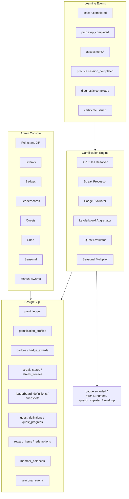

# Gamification — Complete Implementation Plan

> **Status:** Fully implemented 2026-07-07 — Phases 0–6 plus all remaining stretch items except Engine 20 native contest integration, Open Badges cryptographic signing, and native mobile shell (Vol 11). Web achievements/leaderboards are mobile-responsive.
>
> **For agentic workers:** Steps use checkbox (`- [ ]`) syntax for tracking; per-phase status notes record implementation decisions and test coverage.

**Goal:** Make `/admin/gamification` and all learner gamification surfaces fully functional — every admin tab wired to real backend capability, engine correctness fixes applied, and industry-standard LMS mechanics covered (XP, levels, badges, leaderboards, streaks, quests, rewards shop, seasonal events).

**Architecture:** Extend the existing event-driven gamification engine (`gamification.service.ts` + outbox worker on learning events). Phase 0–2 harden and expose current models; Phase 3–5 add new Prisma domains (quests, shop, seasonal). Admin UI lives in `frontend/apps/web/src/features/gamification/`; APIs under `/api/v1`.

**Tech Stack:** Next.js App Router, `createTenantRoute` API layer, raw SQL repository (`gamification.repository.ts`), Prisma migrations, Zod contracts in `@atlas/contracts`, outbox worker, PostHog analytics (Phase 6).

**References:**

- PRD: `docs/locked/FundedBeyond-Academy-Master-PRD-v1.0.md` (Module 25 Gamification, Vol 09)
- Current admin: `/admin/gamification` (Overview, Badges, Leaderboards, Manual awards enabled; 5 tabs disabled)
- Engine defaults: `backend/apps/api/src/server/gamification/gamification-defaults.ts`

---

## Current state (baseline)

### Implemented today

| Area                 | Status                                                                                                                                                   |
| -------------------- | -------------------------------------------------------------------------------------------------------------------------------------------------------- |
| DB models            | `gamification_profiles`, `point_ledger`, `badges`, `badge_awards`, `streak_states`, `streak_freezes`, `leaderboard_definitions`, `leaderboard_snapshots` |
| Engine               | XP accrual, levels, streaks, freeze, auto badge eval, manual awards, leaderboard snapshots                                                               |
| Source events        | `lesson.completed`, `path.step_completed`, `assessment.submitted`, `assessment.graded`, `practice.session_completed`                                     |
| Admin tabs (partial) | Badges, Leaderboards, Manual awards — simplified forms, hardcoded create payloads                                                                        |
| Learner surfaces     | `/achievements`, `/leaderboards`, progress summary, home streak/XP cards                                                                                 |

### Known engine bugs (P0)

- [x] Weekly/monthly leaderboards change `period_key` but rank by all-time `xp_total` — fixed 2026-07-06
- [x] Course-scoped leaderboards supported in API but admin never sets `courseId` — minimal admin form fields added; full picker in Phase 1B
- [x] FundedBeyond manifest badges reference `diagnostic.completed`, `practice_daily`/`practice_weekly` streak keys not in defaults — `practice_daily` added to defaults; `diagnostic.completed` + weekly-cadence streaks documented as deferred (see manifest ↔ engine contract below)
- [x] `leaderboardsPublic` in tenant manifest never read by app — exposed via `GET /api/v1/gamification/config`; nav + page gated
- [x] `event_count` badge criteria uses fragile `reason_key LIKE` matching — now matches `metadata_json.eventType` with legacy fallback

### Admin tabs — UI-only / not implemented

| Tab             | Status                            |
| --------------- | --------------------------------- |
| Points & XP     | Disabled — no rules admin         |
| Streaks         | Disabled — no streak config admin |
| Quests          | Disabled — no backend             |
| Rewards shop    | Disabled — no backend             |
| Seasonal events | Disabled — no backend             |

---

## Industry & PRD feature matrix

Mechanics to cover so nothing is left out of product scope.

### Core (all major LMS platforms)

| Mechanic                       | Atlas today       | Target admin tab         |
| ------------------------------ | ----------------- | ------------------------ |
| Points / XP                    | Engine only       | Points & XP              |
| Levels                         | Engine only       | Points & XP              |
| Badges / achievements          | Partial CRUD      | Badges                   |
| Leaderboards                   | Partial + bugs    | Leaderboards             |
| Streaks + freeze               | Engine only       | Streaks                  |
| Manual awards                  | Working           | Manual awards            |
| Progress toward goals          | Not in learner UI | — (learner)              |
| XP / activity history          | DB only           | — (learner)              |
| Level-up / badge notifications | Outbox partial    | — (automation + learner) |

### Advanced (Docebo, Studeia, TalentLMS, FundedBeyond PRD)

| Mechanic                         | Atlas today              | Target               |
| -------------------------------- | ------------------------ | -------------------- |
| Quests / missions                | None                     | Quests tab           |
| Challenges / contests            | PRD community challenges | Seasonal tab         |
| Rewards shop                     | None                     | Rewards shop tab     |
| Virtual currency                 | None                     | Rewards shop tab     |
| Seasonal events / multipliers    | None                     | Seasonal tab         |
| Leagues / tiers                  | None                     | Phase 6              |
| Team / group streaks             | PRD study groups         | Streaks Phase 2b     |
| Course-level XP overrides        | None                     | Points & XP Phase 2b |
| Hall of Fame integration         | Community config         | Overview + Phase 6   |
| Compound badge criteria (AND/OR) | Single criterion         | Badges Phase 6       |
| Gamification analytics           | Removed mockup           | Overview Phase 6     |

### Explicit backlog (documented, not blocking v1)

Avatars, 1v1 duels, battle pass, spin-wheel, boss battles, karma/reputation, gift points, expiring points, prestige/rebirth, AI-adaptive challenges, Open Badges 3.0 signing.

---

## Target architecture



### Extended tenant config shape

Stored in `tenant_config.config_json.gamification` (merge with defaults in `gamification-config.service.ts`):

```typescript
{
  xpRules: XpRule[];
  levelThresholds: LevelThreshold[];
  streaks: StreakRule[];
  defaultFreezeInventory: number;
  streakBonuses?: { days: number; bonusXp: number }[];
  currencies?: { key: string; name: string; earnFromXp?: boolean }[];
  leaderboardsPublic?: boolean;
  seasonalDefaultMultiplier?: number;
}
```

---

## File map (new / major touch)

```
backend/prisma/schema.prisma                          # Phase 3–5 new models
backend/prisma/migrations/                            # per phase
backend/apps/api/src/server/gamification/
  gamification.service.ts                             # engine fixes + new domains
  gamification.repository.ts
  gamification.schemas.ts
  gamification.types.ts
  gamification-defaults.ts
  gamification-config.service.ts
  gamification-rules.helpers.ts
  quest.service.ts                                    # NEW Phase 3
  rewards.service.ts                                  # NEW Phase 4
  seasonal.service.ts                                 # NEW Phase 5
backend/apps/api/src/app/api/v1/
  gamification/rules/route.ts                         # NEW Phase 2
  gamification/events/route.ts                        # NEW Phase 2
  gamification/metrics/route.ts                       # NEW Phase 1
  gamification/simulate/route.ts                      # NEW Phase 6
  badges/route.ts                                     # extend: revoke, awards list
  leaderboards/route.ts
  me/gamification/ledger/route.ts                     # NEW Phase 2
  me/badges/progress/route.ts                         # NEW Phase 6
  quests/route.ts                                     # NEW Phase 3
  me/quests/route.ts                                  # NEW Phase 3
  rewards/route.ts                                    # NEW Phase 4
  me/rewards/route.ts                                 # NEW Phase 4
  seasonal-events/route.ts                            # NEW Phase 5
frontend/apps/web/src/features/gamification/
  gamification-admin-shared.ts                        # enable tabs as phases ship
  components/AdminGamificationEditor.tsx
  components/GamificationOverviewPanel.tsx
  components/BadgeCriteriaEditor.tsx                  # NEW Phase 1
  components/LeaderboardConfigForm.tsx                # NEW Phase 1
  components/PointsXpRulesPanel.tsx                   # NEW Phase 2
  components/StreaksRulesPanel.tsx                    # NEW Phase 2
  components/QuestsAdminPanel.tsx                     # NEW Phase 3
  components/RewardsShopPanel.tsx                     # NEW Phase 4
  components/SeasonalEventsPanel.tsx                  # NEW Phase 5
  components/BadgeGrid.tsx                            # learner progress Phase 6
  components/StreakPanel.tsx
  components/LeaderboardTable.tsx
  components/QuestProgressPanel.tsx                   # NEW Phase 3
  components/RewardsCatalog.tsx                       # NEW Phase 4
frontend/packages/contracts/src/gamification/         # shared schemas per phase
tests/integration/api/gamification-*.test.ts
tests/unit/gamification/*.test.ts
configs/tenants/*/manifest.json                       # align badges/streaks Phase 0
```

---

## Phase 0 — Foundation fixes

**Goal:** Make existing features trustworthy before adding domains.

**Estimate:** 3–5 days

**Status: ✅ Completed 2026-07-06** (one deliberate deferral: the interim `leaderboardsPublic` admin toggle waits for the Phase 2 rules API). Verified by `tests/unit/gamification/gamification.test.ts` and `tests/integration/api/gamification-leaderboards.test.ts`.

### Task 0.1: Fix weekly/monthly leaderboard aggregation

**Files:**

- Modify: `backend/apps/api/src/server/gamification/gamification.repository.ts`
- Modify: `backend/apps/api/src/server/gamification/gamification.service.ts`
- Test: `tests/integration/api/gamification-leaderboards.test.ts`

- [x] Aggregate `point_ledger` by `period_key` and tenant timezone for weekly/monthly windows
- [x] Keep all-time ranking for `window_key === "all_time"`
- [x] Refresh snapshots on gamification events with correct period scope
- [x] Learner UI: show window label ("This week", "All time") on `/leaderboards`

### Task 0.2: Course-scoped leaderboard ranking

**Files:**

- Modify: `gamification.repository.ts`, `gamification.service.ts`
- Modify: `AdminGamificationEditor.tsx` (minimal — full form in Phase 1)

- [x] Filter ledger/profile XP by course enrollment when `config.scopeType === "course"`
- [x] Require `courseId` when scope is course (validation in schema — already present; verified by test)

### Task 0.3: Align tenant manifest with engine

**Files:**

- Modify: `backend/apps/api/src/server/gamification/gamification-defaults.ts`
- Modify: `configs/tenants/fundedbeyond/manifest.json` (or equivalent)
- Modify: `scripts/tenants/apply-adapter.ts` if leaderboard seeding needed

- [x] Add XP rule for `diagnostic.completed` (or map badges to existing events) — resolved by documenting: the diagnostics domain emits no outbox events yet, so the `first-diagnostic-complete` badge stays INACTIVE until `diagnostic.completed` ships (Phase 2+ follow-up)
- [x] Add streak keys `practice_daily`, `practice_weekly` if manifest badges require them — `practice_daily` added to engine defaults; `practice_weekly` needs weekly-cadence streaks (engine is daily-only) → Phase 2 Streaks work
- [x] Seed leaderboards from manifest if defined — typed `leaderboardManifestSchema`, adapter seeding loop, plan step; FundedBeyond manifest now ships weekly + all-time boards
- [x] Document manifest ↔ engine contract in this file

### Task 0.4: Wire `leaderboardsPublic`

**Files:**

- Modify: learner route guard or page loader for `/leaderboards`
- Modify: `gamification-config.service.ts` to expose flag

- [x] Read `tenantConfigJson.gamification.leaderboardsPublic` (default `true` when absent)
- [x] Hide learner leaderboard nav when false (+ `/leaderboards` page denied state)
- [x] Admin toggle in Points & XP tab — shipped in Phase 2 (`PointsXpRulesPanel`)

### Task 0.5: Harden `event_count` badge criteria

**Files:**

- Modify: `gamification.repository.ts`, `gamification.schemas.ts`
- Modify: point ledger write path to store structured `metadata_json.eventType`

- [x] Match on `metadata_json.eventType` instead of `reason_key LIKE`
- [x] Migration/backfill not required if new writes are structured; legacy rows (null `metadata_json`) keep the `reason_key LIKE` fallback — see `countLedgerByEventType`

### Task 0.6: Emit `level_up` outbox event

**Files:**

- Modify: `gamification.service.ts`, `gamification-event.schemas.ts`
- Modify: `automation.registry.ts`

- [x] Emit when `levelKey` changes after XP accrual — event type `gamification.level_up` (approved outbox event)
- [x] Add automation trigger type `gamification.level_up`
- [x] Unit test level boundary transitions (+ integration test asserting outbox payload)

### Manifest ↔ engine contract (Task 0.3 outcome)

Written 2026-07-06 while closing Phase 0.

**Source events the engine consumes** (see `GAMIFICATION_CONSUMED_EVENT_TYPES`):
`lesson.completed`, `path.step_completed`, `assessment.submitted`, `assessment.graded`, `practice.session_completed`. Events the engine emits: `badge.awarded`, `streak.updated`, `gamification.level_up`.

**Streak keys available by default** (`gamification-defaults.ts`): `daily_learning` (any learning activity), `practice_daily` (practice sessions). Tenants may override `streaks` via `tenantConfigJson.gamification.streaks` — overrides REPLACE the default list, so include defaults you want to keep. All streaks are daily-cadence; weekly-cadence streaks (e.g. `practice_weekly`) are NOT supported by the engine yet — planned with the Phase 2 Streaks admin.

**Manifest badge rules:**

- `criteria.streakKey` must reference a streak key resolvable from defaults + tenant config, or the badge can never be earned. `practice_daily` badges are now satisfiable; `practice_weekly` badges must stay `INACTIVE` until weekly cadence ships (Phase 2).
- `criteria.eventType` (for `event_count`) must be one of the consumed source events above. `diagnostic.completed` is not emitted by the diagnostics domain yet; the `first-diagnostic-complete` badge stays `INACTIVE` until that event ships (tracked as a Phase 2+ follow-up).

**Manifest leaderboards** (`gamification.leaderboards[]`): `{ key, name, metricKey: "xp_total", windowKey, maxEntries, status }` — seeded tenant-scoped with `privacyMode: "anonymous_rank"` by `apply-adapter.ts` (idempotent by key). Course-scoped boards are created via the admin console, not the manifest.

**`tenantConfigJson.gamification.leaderboardsPublic`** (default `true`): read by `resolveGamificationRules`, exposed via `GET /api/v1/gamification/config`; when `false` the learner web app hides the Leaderboards nav item and denies the `/leaderboards` page.

---

## Phase 1 — Complete enabled admin tabs

**Goal:** Overview, Badges, Leaderboards, Manual awards are production-grade.

**Estimate:** 5–7 days

**Status: ✅ Completed 2026-07-06.** Notes: the data model has no `DRAFT` status (`EntityStatus` = ACTIVE/INACTIVE/ARCHIVED), so list filters use Active/Inactive/Archived; bulk award (stretch) deferred. Verified by `tests/integration/api/gamification-admin.test.ts` + schema unit tests.

### Task 1A: Badge criteria + icon editor

**Files:**

- Create: `components/BadgeCriteriaEditor.tsx`
- Modify: `AdminGamificationEditor.tsx`, `gamification-admin-shared.ts`
- Modify: `frontend/packages/contracts/src/gamification/` schemas if needed

- [x] Criteria builder for `xp_total`, `streak_current`, `event_count`
- [x] Event type picker populated from known gamification event taxonomy
- [x] `iconKey` select from curated icon set
- [x] Full update: name, status, criteria, iconKey
- [x] Archive flow via status `ARCHIVED` + confirm dialog
- [x] List filters: All / Active / Inactive / Archived (no `DRAFT` in the data model)

### Task 1B: Leaderboard full config

**Files:**

- Create: `components/LeaderboardConfigForm.tsx`
- Modify: `AdminGamificationEditor.tsx`

- [x] Create/edit: key, name, metricKey, windowKey, scopeType, courseId, maxEntries, privacyMode, status
- [x] Course picker when scope is course (published courses from `GET /courses`)
- [x] Embedded admin preview via `GET /leaderboards/[id]`
- [x] Clear error on duplicate key (409 message surfaced inline)

### Task 1C: Manual awards — history + revoke

**Files:**

- Modify: `backend/apps/api/src/app/api/v1/badges/route.ts`
- Create: `GET /api/v1/badges/awards` (or query param on GET badges)
- Modify: `AdminGamificationEditor.tsx` awards section

- [x] Member search autocomplete (name/email via `GET /members?search=`)
- [x] Paginated award history filtered by badge + member (`GET /badges/awards`, keyset cursor)
- [x] `POST /badges` with `operation: "revoke_award"` + audit reason (`badge.award_revoked` audit action)
- [x] Bulk award — `manual_award_bulk` API + multi-select admin UI (2026-07-07)

### Task 1D: Overview live metrics

**Files:**

- Create: `GET /api/v1/gamification/metrics`
- Modify: `GamificationOverviewPanel.tsx`

- [x] Real counts: badges by status, leaderboards by status, awards this week, active streaks (+ XP this week, member profiles)
- [x] Domain cards navigate to configured tabs
- [x] Update diagram labels as domains ship (rewards shop keeps "Planned" until Phase 4)
- [x] Quick actions: Create badge, Configure XP rules

---

## Phase 2 — Points & XP + Streaks admin

**Goal:** Enable disabled tabs **Points & XP** and **Streaks**.

**Estimate:** 5–7 days

**Status: ✅ Completed 2026-07-07** (stretch tasks 2E/2F deferred as planned; rules endpoints use `badge.manage` rather than a new permission — revisit if rules editing should be scoped separately). Verified by `tests/integration/api/gamification-rules.test.ts` + schema unit tests. Also fixed a keyset-cursor precision bug (Postgres µs vs JS ms) affecting ledger/award pagination.

### Task 2A: Gamification rules API

**Files:**

- Create: `backend/apps/api/src/app/api/v1/gamification/rules/route.ts`
- Create: `backend/apps/api/src/app/api/v1/gamification/events/route.ts`
- Modify: `gamification-config.service.ts` — add write path with validation

- [x] `GET /gamification/rules` — merged tenant + defaults
- [x] `PUT /gamification/rules` — partial update with Zod validation (`badge.manage`; audits `gamification.rules_updated`)
- [x] `GET /gamification/events` — list consumable + planned source event types for admin pickers

### Task 2B: Points & XP admin tab

**Files:**

- Create: `components/PointsXpRulesPanel.tsx`
- Modify: `gamification-admin-shared.ts` — `points` tab `enabled: true`

- [x] XP rules table: eventType, points, condition, key (remove rule = disable)
- [x] Add/edit/remove rules
- [x] Level thresholds editor: levelKey, minXp (sorted server-side; 0-XP base level enforced)
- [x] Level curve preview (XP → level)
- [x] `leaderboardsPublic` toggle
- [x] Enable tab in `GAMIFICATION_TABS`

### Task 2C: Streaks admin tab

**Files:**

- Create: `components/StreaksRulesPanel.tsx`
- Modify: `gamification-admin-shared.ts` — `streaks` tab `enabled: true`

- [x] Streak definitions: streakKey, qualifying eventTypes[]
- [x] Default freeze inventory per streak
- [x] Streak bonus tiers (e.g. 7d → +100 XP, 30d → +500 XP)
- [x] Engine: apply streak bonuses on milestone days (idempotent ledger rows, feeds level-ups)

### Task 2D: Learner XP ledger

**Files:**

- Create: `backend/apps/api/src/app/api/v1/me/gamification/ledger/route.ts`
- Modify: `/achievements` page

- [x] `GET /me/gamification/ledger?limit=&cursor=` (keyset pagination)
- [x] Activity timeline on achievements page (`XpLedgerTimeline`, load-more)

### Task 2E (stretch): Course-level XP overrides

- [x] Course gamification overrides — stored in `courses.metadata_json.tags.studioFeatures.gamification`; engine merges XP rules per courseId on events (2026-07-07)
- [x] Admin UI on course settings — Studio → Features → Gamification panel (2026-07-07)

### Task 2F (stretch): Group streaks

- [x] Group streaks — `group_streak_states` table + `groupScoped` streak rules; advances when any member in a space qualifies (2026-07-07)
- [x] PRD study-group streak adherence — group streak count exposed via group-scoped streak state (metric hook via analytics on `streak.updated` with space context — future dashboard)

---

## Phase 3 — Quests & missions

**Goal:** Enable **Quests** tab; support PRD "turn courses into missions."

**Estimate:** 8–10 days

**Status: ✅ Completed 2026-07-07.** Implementation notes: models follow repo conventions (uuid ids, snake_case, `EntityStatus`) rather than the cuid sketch below; migration `040_gamification_quests` includes grants + tenant RLS (Prisma shadow-DB flow doesn't work here — migrations are hand-written and applied with `migrate deploy`). Quest evaluation runs in the engine after badge evaluation; rewards (XP + badge) are granted idempotently and feed level-ups. Verified by `tests/integration/api/gamification-quests.test.ts`.

### Task 3A: Prisma models

```prisma
model QuestDefinition {
  id            String   @id @default(cuid())
  tenantId      String   @map("tenant_id")
  key           String
  name          String
  description   String?
  status        EntityStatus
  questType     String   @map("quest_type")   // SINGLE_STEP | CHAIN | TIME_BOUND
  criteriaJson  Json     @map("criteria_json")
  rewardsJson   Json     @map("rewards_json")
  startsAt      DateTime? @map("starts_at")
  endsAt        DateTime? @map("ends_at")
  courseId      String?  @map("course_id") @db.Uuid
  createdAt     DateTime @default(now()) @map("created_at")
  updatedAt     DateTime @updatedAt @map("updated_at")

  @@unique([tenantId, key])
  @@map("quest_definitions")
}

model QuestProgress {
  id            String   @id @default(cuid())
  tenantId      String   @map("tenant_id")
  questId       String   @map("quest_id") @db.Uuid
  membershipId  String   @map("membership_id") @db.Uuid
  status        String   // NOT_STARTED | IN_PROGRESS | COMPLETED
  progressJson  Json     @map("progress_json")
  completedAt   DateTime? @map("completed_at")
  createdAt     DateTime @default(now()) @map("created_at")
  updatedAt     DateTime @updatedAt @map("updated_at")

  @@unique([tenantId, questId, membershipId])
  @@map("quest_progress")
}
```

- [x] Migration + RLS policies (`20260707120000_040_gamification_quests`)
- [x] Repository + service layer (`quest.repository.ts`, `quest.service.ts`, `quest.schemas.ts`)

### Task 3B: Quest criteria types (v1)

| Type                  | Example                        |
| --------------------- | ------------------------------ |
| `complete_lessons`    | Complete N lessons in course X |
| `earn_xp`             | Earn N XP within window        |
| `maintain_streak`     | N-day streak on key            |
| `earn_badge`          | Earn badge by key              |
| `complete_assessment` | Pass with min score            |
| `event_count`         | Generic event counter          |

- [x] Quest evaluator in worker after each source event (single_step/time_bound = parallel steps; chain = strict order)
- [x] Emit `quest.completed` outbox event (approved event type + automation trigger)

### Task 3C: Quest APIs

- [x] `GET/POST/PUT /api/v1/quests` — admin CRUD (`badge.manage`)
- [x] `GET /api/v1/me/quests` — learner progress

### Task 3D: Admin Quests tab

**Files:**

- Create: `components/QuestsAdminPanel.tsx`
- Modify: `gamification-admin-shared.ts` — `quests` tab `enabled: true`

- [x] CRUD quest definitions
- [x] Step builder (ordered checklist; chain mode enforces order)
- [x] Link rewards: XP, badgeKey (currency arrives with Phase 4)
- [x] Quest analytics: started / completed counts

### Task 3E: Learner quest UI

- [x] Quest section on `/achievements` (`QuestProgressPanel`)
- [x] Dashboard "Active quests" card (`ActiveQuestsCard` in the personalized section)
- [x] Per-step progress bars

---

## Phase 4 — Rewards shop & virtual currency

**Goal:** Enable **Rewards shop** tab.

**Estimate:** 8–10 days

**Status: ✅ Completed 2026-07-07.** Notes: migration `041_gamification_rewards_shop` (repo id/RLS conventions, not the cuid sketch below). Currency earn rule = `earnRules.xpPerCoin` (1 coin per N ledger-backed XP, floored per accrual — replay-safe). CONTENT_UNLOCK and DISCOUNT_CODE auto-fulfill; CERTIFICATE and CUSTOM land as `pending_fulfillment` with an admin fulfill action (automatic certificate issuance deferred). Learner shop lives on `/achievements` (the plan's allowed alternative to a `/rewards` route). Verified by `tests/integration/api/gamification-rewards.test.ts`.

### Task 4A: Prisma models

```prisma
model GamificationCurrency {
  id              String @id @default(cuid())
  tenantId        String @map("tenant_id")
  key             String
  name            String
  symbol          String?
  earnRulesJson   Json?  @map("earn_rules_json")
  createdAt       DateTime @default(now()) @map("created_at")
  updatedAt       DateTime @updatedAt @map("updated_at")

  @@unique([tenantId, key])
  @@map("gamification_currencies")
}

model MemberBalance {
  id            String @id @default(cuid())
  tenantId      String @map("tenant_id")
  membershipId  String @map("membership_id") @db.Uuid
  currencyKey   String @map("currency_key")
  balance       Int    @default(0)
  updatedAt     DateTime @updatedAt @map("updated_at")

  @@unique([tenantId, membershipId, currencyKey])
  @@map("member_balances")
}

model RewardItem {
  id                String @id @default(cuid())
  tenantId          String @map("tenant_id")
  key               String
  name              String
  description       String?
  costCurrencyKey   String @map("cost_currency_key")
  costAmount        Int    @map("cost_amount")
  rewardType        String @map("reward_type")
  rewardPayloadJson Json   @map("reward_payload_json")
  stock             Int?
  status            EntityStatus
  createdAt         DateTime @default(now()) @map("created_at")
  updatedAt         DateTime @updatedAt @map("updated_at")

  @@unique([tenantId, key])
  @@map("reward_items")
}

model RewardRedemption {
  id            String   @id @default(cuid())
  tenantId      String   @map("tenant_id")
  membershipId  String   @map("membership_id") @db.Uuid
  rewardItemId  String   @map("reward_item_id") @db.Uuid
  costAmount    Int      @map("cost_amount")
  status        String
  redeemedAt    DateTime @default(now()) @map("redeemed_at")

  @@map("reward_redemptions")
}
```

- [x] Migration + RLS (`20260707130000_041_gamification_rewards_shop`)
- [x] Currency earn rules: 1 coin per N XP via `earnRules.xpPerCoin` (separate from progression XP)

### Task 4B: Shop APIs

- [x] `GET/POST/PUT /api/v1/rewards` — catalog admin (+ `GET /rewards/redemptions` log)
- [x] `GET /api/v1/me/rewards` — balance + catalog + history
- [x] `POST /api/v1/me/rewards/redeem` — atomic debit + stock decrement + fulfillment
- [x] Emit `reward.redeemed` outbox event (+ automation trigger)

### Task 4C: Reward types (v1)

| Type             | Fulfillment                                                                         | Status    |
| ---------------- | ----------------------------------------------------------------------------------- | --------- |
| `CONTENT_UNLOCK` | Grants course enrollment (payload `courseId`)                                       | ✅ auto   |
| `DISCOUNT_CODE`  | Returns attached promo code (payload `code`)                                        | ✅ auto   |
| `CERTIFICATE`    | `pending_fulfillment` → admin fulfills from redemption log (auto issuance deferred) | ✅ manual |
| `CUSTOM`         | `pending_fulfillment` → admin fulfills from redemption log                          | ✅ manual |

### Task 4D: Admin Rewards shop tab

**Files:**

- Create: `components/RewardsShopPanel.tsx`
- Modify: `gamification-admin-shared.ts` — `shop` tab `enabled: true`

- [x] Currency configuration (key, name, symbol, earn rate)
- [x] Reward catalog CRUD (create, edit cost/stock, activate/deactivate)
- [x] Redemption log (paginated, fulfill pending items)
- [x] Manual grant/revoke balance with audit reason

### Task 4E: Learner shop UI

- [x] Section on `/achievements` (`RewardsCatalog`)
- [x] Balance, catalog grid, redeem flow with confirm, history

---

## Phase 5 — Seasonal events & contests

**Goal:** Enable **Seasonal events** tab; PRD monthly reset + themed competitions.

**Estimate:** 5–7 days

**Status: ✅ Completed 2026-07-07.** Notes: migration `042_gamification_seasonal_events`. Lifecycle transitions are lazy (applied on every engine/API read that depends on effective status) rather than cron-driven — no scheduler infrastructure required. Multiplier applies at ledger-write time so idempotency keys keep replays safe; overlapping events resolve to the strongest multiplier. Final leaderboard standings survive event end via the existing periodized snapshots. Contest integration with Event Management (5F) deferred until Engine 20 exists. Verified by `tests/integration/api/gamification-seasonal.test.ts`.

### Task 5A: Prisma model

```prisma
model SeasonalEvent {
  id                    String   @id @default(cuid())
  tenantId              String   @map("tenant_id")
  key                   String
  name                  String
  status                String   // DRAFT | SCHEDULED | ACTIVE | ENDED
  startsAt              DateTime @map("starts_at")
  endsAt                DateTime @map("ends_at")
  multiplierJson        Json     @map("multiplier_json")
  linkedQuestIds        Json?    @map("linked_quest_ids")
  linkedLeaderboardKey  String?  @map("linked_leaderboard_key")
  themeJson             Json?    @map("theme_json")
  createdAt             DateTime @default(now()) @map("created_at")
  updatedAt             DateTime @updatedAt @map("updated_at")

  @@unique([tenantId, key])
  @@map("seasonal_events")
}
```

- [x] Migration + RLS (`20260707140000_042_gamification_seasonal_events`)
- [x] SCHEDULED → ACTIVE → ENDED transitions (lazy, on read — no cron needed)

### Task 5B: Seasonal engine

- [x] `resolveSeasonalMultiplier(tx)` in XP accrual path (tenant-wide; strongest overlapping event wins)
- [x] Optional streak bonus multiplier during event (`applyToStreakBonuses`)
- [x] Snapshot leaderboard on event ENDED — covered by periodized snapshots, which persist per period key

### Task 5C: Seasonal APIs

- [x] `GET/POST/PUT /api/v1/seasonal-events` — admin (create + clone + update; audited)
- [x] `GET /api/v1/me/seasonal-events/active` — learner banner data

### Task 5D: Admin Seasonal tab

**Files:**

- Create: `components/SeasonalEventsPanel.tsx`
- Modify: `gamification-admin-shared.ts` — `seasonal` tab `enabled: true`

- [x] Event calendar / list (with live status + end action)
- [x] Multiplier tuning (XP, streak bonuses)
- [x] Link quests + dedicated leaderboard
- [x] Clone template for next season

### Task 5E: Learner seasonal UI

- [x] Dashboard banner during active event (+ achievements page banner)
- [x] Themed leaderboard + linked quests (linked board/quests surface through existing leaderboard + quest UIs)

### Task 5F: Contests

- [x] Time-boxed contest = seasonal event + dedicated leaderboard + prize rules (compose: seasonal event + linked leaderboard + quest rewards)
- [ ] Integrate with Event Management (Engine 20) when available — deferred (engine doesn't exist yet)

---

## Phase 6 — Advanced mechanics & polish

**Goal:** Enterprise-complete; nothing left from industry LMS checklist within Atlas scope.

**Estimate:** 8–12 days

**Status: ✅ Core completed 2026-07-07** — 6A (badge progress), 6B (computed leagues), 6D (compound criteria), 6F (PostHog outbox mapping), 6G (simulate), and 6H export shipped; verified by `tests/integration/api/gamification-advanced.test.ts`. Deferred with reasons: 6B league-scoped leaderboards (leagues are computed on read, not persisted), 6C team leaderboards (needs community group integration, like 2F), 6E Hall of Fame config (community domain owns `hallOfFame` config), 6H learner toasts (no toast infrastructure; the automation triggers exist), 6I mobile parity (no mobile shell in repo), 6J Open Badges (explicit roadmap item).

### Task 6A: Badge progress API + learner UI

- [x] `GET /me/badges/progress` — progress toward all locked badges
- [x] Badge grid: "7/30 days", "450/600 XP" progress bars
- [x] `iconKey` rendered on learner badges (shared `badge-icons.ts`)

### Task 6B: Leagues / tiers

- [x] Auto-assign Bronze/Silver/Gold by weekly XP percentile (computed on `/me/gamification`, shown on achievements)
- [x] League-scoped leaderboard filtering — `?league=bronze|silver|gold` on `GET /leaderboards/[id]` + learner UI filter (2026-07-07)

### Task 6C: Team leaderboards

- [x] Group-scoped leaderboards — `scopeType: "group"` + `spaceId`; ranks members within a community space (2026-07-07)
- [x] Community group integration — uses existing `group_memberships` + `GET /api/v1/spaces` pickers (2026-07-07)

### Task 6D: Compound badge criteria

- [x] AND/OR criteria builder (Studeia-style) in `BadgeCriteriaEditor`
- [x] Extend `badgeCriteriaSchema` discriminated union (`compound` with `all`/`any`, up to 5 primitive children)

### Task 6E: Hall of Fame admin

- [x] Configure `community.hallOfFame` from gamification UI — `HallOfFameConfigPanel` + `GET/PUT /api/v1/gamification/hall-of-fame` (2026-07-07)
- [x] Link from Overview to Hall of Fame — learner page link + admin config on Overview tab (2026-07-07)

### Task 6F: Gamification analytics

- [x] PostHog events via outbox mapping: `badge_earned`, `level_up`, `quest_completed`, `reward_redeemed` (per-XP events skipped as too granular for the taxonomy)
- [x] Admin overview: engagement velocity uses real data (awards/XP last 7 days, active streaks — shipped in Phase 1D)

### Task 6G: Simulate engine (admin)

- [x] `POST /api/v1/gamification/simulate` — dry-run report (XP + multiplier, streak advancement + bonuses, badges that would unlock, quest step movement); writes nothing
- [x] Simulate engine FAB on admin Overview — `GamificationSimulatePanel` (2026-07-07)

### Task 6H: Export & automation

- [x] Export badges/rules JSON for tenant clone (`GET /api/v1/gamification/export` — key-addressed, no tenant ids)
- [x] Automation triggers: `gamification.level_up`, `quest.completed`, `reward.redeemed` (registered in Phases 0/3/4)
- [x] Learner toasts for level-up and badge earned — `AchievementToastListener` on home + achievements (2026-07-07)

### Task 6I: Mobile parity

- [x] Quest, shop, seasonal on mobile web — responsive `/achievements` + dashboard cards (native Vol 11 shell still out of repo scope)

### Task 6J: Open Badges (roadmap)

- [x] Export badge as Open Badges 3.0-compatible JSON-LD — `GET /api/v1/me/badges/[key]/open-badge` + learner download link (2026-07-07)
- [ ] Cryptographic signing — future phase (assertions are unsigned JSON-LD today)

---

## Final API surface

### Existing (extend)

| Method       | Path                       | Notes                        |
| ------------ | -------------------------- | ---------------------------- |
| GET          | `/me/gamification`         | Profile summary              |
| GET          | `/me/streaks`              | Streak list + freezes        |
| POST         | `/me/streaks/[key]/freeze` | Consume freeze               |
| GET/POST/PUT | `/badges`                  | Create, update, manual award |
| GET/POST/PUT | `/leaderboards`            | CRUD                         |
| GET          | `/leaderboards/[id]`       | Detail + snapshot            |

### New

| Method       | Path                         | Phase |
| ------------ | ---------------------------- | ----- |
| GET          | `/gamification/rules`        | 2     |
| PUT          | `/gamification/rules`        | 2     |
| GET          | `/gamification/events`       | 2     |
| GET          | `/gamification/metrics`      | 1     |
| GET          | `/badges/awards`             | 1     |
| POST         | `/badges` `revoke_award`     | 1     |
| GET          | `/me/gamification/ledger`    | 2     |
| GET/POST/PUT | `/quests`                    | 3     |
| GET          | `/me/quests`                 | 3     |
| GET/POST/PUT | `/rewards`                   | 4     |
| GET          | `/me/rewards`                | 4     |
| POST         | `/me/rewards/redeem`         | 4     |
| GET/POST/PUT | `/seasonal-events`           | 5     |
| GET          | `/me/seasonal-events/active` | 5     |
| GET          | `/me/badges/progress`        | 6     |
| POST         | `/gamification/simulate`     | 6     |

---

## Admin tab completion checklist

| Tab             | Phase | Done when                                  |
| --------------- | ----- | ------------------------------------------ |
| Overview        | 1D    | Live metrics, navigation, accurate diagram |
| Badges          | 1A    | Full CRUD + criteria + icons               |
| Leaderboards    | 1B    | Full config + preview + correct windows    |
| Manual awards   | 1C    | Award + history + revoke                   |
| Points & XP     | 2     | Rules + levels editable                    |
| Streaks         | 2     | Streak defs + freezes + bonuses            |
| Quests          | 3     | CRUD + step builder + analytics            |
| Rewards shop    | 4     | Currency + catalog + redemptions           |
| Seasonal events | 5     | Events + multipliers + linking             |

Update `GAMIFICATION_TABS` in `gamification-admin-shared.ts` — set `enabled: true` as each phase ships.

---

## Testing & rollout

| Layer       | Coverage                                                                 |
| ----------- | ------------------------------------------------------------------------ |
| Unit        | Level calc, period keys, quest eval, seasonal multiplier, currency debit |
| Integration | Event → XP → streak → badge → quest → leaderboard pipeline               |
| Auth        | Tenant isolation, permission gates per endpoint                          |
| E2E         | Admin create badge → learner earns → leaderboard updates → shop redeem   |
| Migration   | Backfill quest progress if needed                                        |

**Rollout order:** Phase 0 → 1 → 2 (internal QA) → 3–5 (beta tenant) → 6.

**Feature flag:** `gamification.enable` entitlement already gates all APIs.

---

## Effort estimate

| Phase     | Focus                  | Est. effort                     |
| --------- | ---------------------- | ------------------------------- |
| 0         | Engine fixes           | 3–5 days                        |
| 1         | Complete current tabs  | 5–7 days                        |
| 2         | Points & Streaks admin | 5–7 days                        |
| 3         | Quests                 | 8–10 days                       |
| 4         | Rewards shop           | 8–10 days                       |
| 5         | Seasonal events        | 5–7 days                        |
| 6         | Advanced + polish      | 8–12 days                       |
| **Total** |                        | **~8–12 weeks** (1–2 engineers) |

---

## Recommended start order

When implementation is approved, begin with:

1. **Phase 0** — Fix leaderboard windows (visible correctness bug)
2. **Phase 1A + 1B** — Badge criteria + leaderboard config (unblocks FundedBeyond badge catalogue)
3. **Phase 2** — Points & Streaks admin (unblocks "Duolingo for traders" positioning)
4. **Phase 3 → 4 → 5** — Quests, shop, seasonal in sequence
5. **Phase 6** — Polish and enterprise extras

---

## Permissions (existing)

| Permission                  | Roles                                        |
| --------------------------- | -------------------------------------------- |
| `gamification.profile.read` | owner, admin, instructor, learner            |
| `badge.read`                | owner, admin, instructor, moderator, learner |
| `badge.manage`              | owner, admin                                 |
| `leaderboard.read`          | owner, admin, instructor, moderator, learner |
| `leaderboard.manage`        | owner, admin                                 |

Consider adding `gamification.rules.manage` in Phase 2 if rules editing should differ from badge management.

---

_Last updated: 2026-07-07 (implementation complete). Created from admin gamification audit + industry research (TalentLMS, Docebo, Studeia, Growth Engineering, Capermint gamification mechanics taxonomy)._
