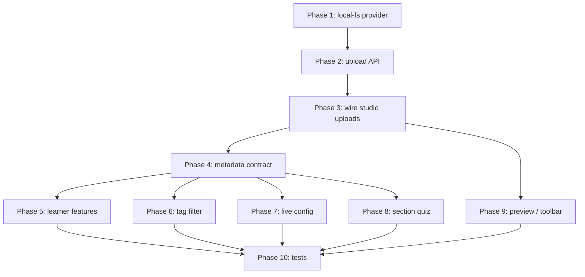

# Inline Lesson Gaps + Local Filesystem Storage — Implementation Plan

> **For agentic workers:** REQUIRED SUB-SKILL: Use superpowers:subagent-driven-development (recommended) or superpowers:executing-plans to implement this plan task-by-task. Steps use checkbox (`- [ ]`) syntax for tracking.

**Goal:** Close every UI-only gap in the inline lesson editor/settings flow, using a persistent project-local filesystem store (`.storage/`) instead of cloud/R2 for dev.

**Architecture:** Extend the existing `@atlas/storage` signed-upload pipeline (already used by branding + SCORM) with a `local-fs` provider that reads/writes under `STORAGE_LOCAL_ROOT`. Lesson uploads follow the SCORM three-step pattern (`upload` → `blob` for local-fs → `confirm` → `attach` with `storageReferenceId`). Lesson metadata (`features`, `displayInSyllabus`, `thumbnailRef`, `primaryAssetRef`, `live`, `assessmentId`, `discussionPostId`, `transcript`) lives in `content_json` with typed contracts and learner enforcement.

**Tech Stack:** Next.js App Router, existing `createTenantRoute` API layer, Prisma/raw SQL, `@atlas/storage`, React client components, Zod contracts in `@atlas/contracts`.

---

## Gap inventory (what this plan closes)

| Gap                                             | Resolution                                                                                                                 |
| ----------------------------------------------- | -------------------------------------------------------------------------------------------------------------------------- |
| Upload drop zone / Cloud Storage                | Signed upload + attach primary lesson asset (audio/pdf/slides; video stays embed-only per policy)                          |
| Attachments sidebar file upload                 | Same upload helper → `POST /lessons/:id/assets` with `storageReferenceId`                                                  |
| Thumbnail upload                                | `lesson.thumbnail` purpose upload → save `thumbnailAssetReferenceId` in settings                                           |
| Rich description toolbar                        | Markdown insertion toolbar (Bold/Italic/Link/List) on textarea — no new editor dependency                                  |
| Display in syllabus                             | SQL filter on studio + published lesson lists                                                                              |
| Feature toggles (comments/downloads/transcript) | Expose on learner detail; gate UI                                                                                          |
| Course `?tagId=` filter                         | Read search param; filter module lesson lists                                                                              |
| Live lesson Configure                           | Persist `live` config in `content_json`; configure form                                                                    |
| Section quiz Continue                           | Link/create `assessmentId` in `content_json`; open studio assessment builder                                               |
| Preview button                                  | Reuse `LessonPreviewPanel` in inline modal                                                                                 |
| Article Publish                                 | Navigate to full lesson editor review tab OR trigger course publish workflow entry — use “open full editor” link (minimal) |
| Local storage                                   | `.storage/` directory at repo root, gitignored                                                                             |

---

## File map (new / major touch)

```
.storage/                                    # gitignored runtime files
backend/packages/storage/src/providers/
  local-filesystem-storage-provider.ts       # NEW — persistent disk provider
backend/packages/storage/src/schemas/storage-env.ts
backend/apps/api/src/server/lessons/
  lesson-asset-upload.service.ts             # NEW — upload/blob/confirm
  lesson-content-metadata.ts                 # NEW — shared content_json helpers
  lessons.repository.ts                      # displayInSyllabus filter
  lessons.service.ts                         # learner features + thumbnail URL projection
backend/apps/api/src/app/api/v1/lessons/[id]/assets/
  upload/route.ts                            # NEW
  blob/route.ts                              # NEW
  confirm/route.ts                           # NEW
frontend/apps/web/src/features/studio/courses/
  upload-lesson-asset.ts                     # NEW — shared client upload helper
  inline-lesson-editor/*                     # wire all workspaces
frontend/apps/web/src/features/lessons/
  lesson-player-shell.tsx                    # features, thumbnail, comments, transcript
  lesson-comments-panel.tsx                  # NEW
  lesson-transcript-panel.tsx                # NEW
frontend/packages/contracts/src/lessons/
  lesson-schemas.ts                          # features, thumbnailUrl, settings fields
tests/integration/api/lesson-asset-upload.test.ts
tests/unit/storage/local-filesystem-storage-provider.test.ts
```

---

## Phase 1 — Local filesystem storage provider

### Task 1: Add `local-fs` storage provider

**Files:**

- Create: `backend/packages/storage/src/providers/local-filesystem-storage-provider.ts`
- Modify: `backend/packages/storage/src/providers/storage-provider-factory.ts`
- Modify: `backend/packages/storage/src/schemas/storage-env.ts`
- Modify: `backend/packages/storage/src/index.ts`
- Modify: `.gitignore`
- Test: `tests/unit/storage/local-filesystem-storage-provider.test.ts`

- [ ] **Step 1: Extend storage env**

Add to `StorageEnvSchema`:

```ts
STORAGE_PROVIDER: z.enum(["r2", "local-mock", "local-fs"]).default("local-fs"),
STORAGE_LOCAL_ROOT: z.string().min(1).default(".storage"),
```

Resolve `STORAGE_LOCAL_ROOT` to an absolute path from repo root (use `path.resolve(process.cwd(), env.STORAGE_LOCAL_ROOT)`).

- [ ] **Step 2: Implement `LocalFilesystemStorageProvider`**

Implement `StorageProvider` interface:

- `putObject` → write `path.join(root, bucket, key)` (create parent dirs)
- `getObjectBody` → read file or return null
- `headObject` → stat file for size/content-type
- `deleteObject` → unlink file
- `createSignedUploadUrl` → return URL `http://localhost.local-storage/upload/...` (same marker as mock — frontend detects this)
- `createSignedDownloadUrl` → return URL pointing to new API static route **or** `file://` avoided; use `/api/v1/storage/local/download?...` with HMAC token

- [ ] **Step 3: Wire factory**

```ts
if (env.STORAGE_PROVIDER === "local-fs") {
  return new LocalFilesystemStorageProvider(env);
}
```

Default dev to `local-fs`; keep `local-mock` for unit tests that need in-memory isolation.

- [ ] **Step 4: Gitignore**

Add to `.gitignore`:

```
.storage/
```

- [ ] **Step 5: Tests**

```ts
it("persists object across provider instances", async () => {
  const root = await fs.mkdtemp(path.join(os.tmpdir(), "atlas-storage-"));
  const provider = new LocalFilesystemStorageProvider({ STORAGE_LOCAL_ROOT: root, ... });
  await provider.putObject({ bucket: "atlas-assets", key: "t1/lesson/x.pdf", body: Buffer.from("pdf"), contentType: "application/pdf" });
  const reloaded = new LocalFilesystemStorageProvider({ STORAGE_LOCAL_ROOT: root, ... });
  expect(await reloaded.getObjectBody({ bucket: "atlas-assets", key: "t1/lesson/x.pdf" })).toEqual(Buffer.from("pdf"));
});
```

- [ ] **Step 6: Update `.env.example`**

```
STORAGE_PROVIDER=local-fs
STORAGE_LOCAL_ROOT=.storage
```

---

## Phase 2 — Lesson asset upload API (mirror SCORM)

### Task 2: Backend upload / blob / confirm routes

**Files:**

- Create: `backend/apps/api/src/server/lessons/lesson-asset-upload.service.ts`
- Create: `backend/apps/api/src/app/api/v1/lessons/[id]/assets/upload/route.ts`
- Create: `backend/apps/api/src/app/api/v1/lessons/[id]/assets/blob/route.ts`
- Create: `backend/apps/api/src/app/api/v1/lessons/[id]/assets/confirm/route.ts`
- Modify: `backend/apps/api/src/server/lessons/lesson-schemas.ts`
- Test: `tests/integration/api/lesson-asset-upload.test.ts`

- [ ] **Step 1: Schemas**

```ts
export const lessonAssetUploadBodySchema = z
  .object({
    purpose: z.enum(["lesson.asset", "lesson.attachment", "lesson.thumbnail"]),
    fileName: z.string().min(1).max(240),
    contentType: z.string().min(1).max(180),
    sizeBytes: z.number().int().min(1),
  })
  .strict();

export const lessonAssetBlobBodySchema = z
  .object({
    assetReferenceId: z.string().uuid(),
    contentBase64: z.string().min(1),
  })
  .strict();

export const lessonAssetConfirmBodySchema = z
  .object({
    assetReferenceId: z.string().uuid(),
  })
  .strict();
```

- [ ] **Step 2: Service methods**

Reuse `createLessonAssetUpload` from `@atlas/storage/lesson-asset.service` with `resourceType: "lesson"`, `resourceId: lessonId`.

`storeLessonAssetBlobService` — copy pattern from `storeModuleScormPackageBlobService` (validate pending ref, decode base64, `provider.putObject`).

`confirmLessonAssetUploadService` — call `confirmAssetUpload`, return asset reference id.

- [ ] **Step 3: Routes**

`POST /api/v1/lessons/:id/assets/upload` → signed upload response  
`POST /api/v1/lessons/:id/assets/blob` → local-fs blob ingest  
`POST /api/v1/lessons/:id/assets/confirm` → mark READY

All require studio lesson ownership + course DRAFT (same guard as `attachLessonAsset`).

- [ ] **Step 4: Integration test**

Upload small PDF via upload → blob → confirm → attach → list assets → learner download URL non-null.

---

### Task 3: Shared frontend upload helper

**Files:**

- Create: `frontend/apps/web/src/features/studio/courses/upload-lesson-asset.ts`

- [ ] **Implement `uploadLessonAssetFile(lessonId, file, purpose)`**

Copy structure from `upload-module-scorm-package.ts`:

1. `POST .../assets/upload`
2. If URL contains `localhost.local-storage` → `POST .../assets/blob` with base64
3. Else → `fetch` PUT to signed URL
4. `POST .../assets/confirm`
5. Return `assetReferenceId`

- [ ] **Add `attachLessonAssetReference(lessonId, assetReferenceId, assetType)`**

`POST /api/v1/lessons/:id/assets` with `{ storageReferenceId, assetType, provider: "r2" }` (provider value stays `r2` — storage layer abstraction).

---

## Phase 3 — Wire studio upload surfaces

### Task 4: Attachments sidebar real file upload

**Files:**

- Modify: `frontend/apps/web/src/features/studio/courses/inline-lesson-editor/lesson-attachments-sidebar.tsx`
- Modify: `frontend/apps/web/src/features/studio/lessons/lesson-asset-panel.tsx` (full editor parity)

- [ ] Replace `attachFile` body:

```ts
const assetReferenceId = await uploadLessonAssetFile(lessonId, file, "lesson.attachment");
await attachLessonAssetReference(lessonId, assetReferenceId, file.type || "file");
```

- [ ] Show upload progress + errors; disable controls while busy.

---

### Task 5: Upload workspace (audio / pdf / slides)

**Files:**

- Modify: `lesson-upload-workspace.tsx`
- Modify: `inline-lesson-editor.tsx`

- [ ] On file select/drop: call `uploadLessonAssetFile` with `purpose: "lesson.asset"`.
- [ ] Save `primaryAssetReferenceId` (+ optional `primaryAssetFileName`) via `PUT /lessons/:id`:

```ts
content: {
  ...existing,
  primaryAssetReferenceId: assetReferenceId,
  primaryAssetFileName: file.name,
}
```

- [ ] When primary asset exists, show file card + download link (studio signed URL) instead of empty drop zone.
- [ ] **Video type:** keep embed-only; file picker disabled with helper text (“Use Embed video for video lessons”).
- [ ] Cloud Storage button triggers same file flow as drop zone.

---

### Task 6: Thumbnail upload in settings branding

**Files:**

- Modify: `inline-lesson-settings-branding.tsx`
- Modify: `lesson-settings-metadata.ts`

- [ ] On file select: `uploadLessonAssetFile(lessonId, file, "lesson.thumbnail")`.
- [ ] Store `thumbnailAssetReferenceId` in form state (not blob URL).
- [ ] `buildLessonSettingsPayload` writes `thumbnailAssetReferenceId` to `content_json`; remove blob URL path.
- [ ] Preview via `GET /api/v1/lessons/:id/assets?view=studio` signed URL for that ref, or dedicated `thumbnailUrl` projected from backend on lesson detail.

**Backend projection (Task 6b):**

- Modify `getLessonForEditor` / `getLessonForPlayer` to resolve `thumbnailAssetReferenceId` → short-lived `thumbnailUrl` using `createLessonAssetDownload`.

---

## Phase 4 — Lesson content metadata contract

### Task 7: Typed `content_json` helpers

**Files:**

- Create: `backend/apps/api/src/server/lessons/lesson-content-metadata.ts`
- Modify: `frontend/packages/contracts/src/lessons/lesson-schemas.ts`
- Modify: `lesson-settings-metadata.ts`

- [ ] **Define shared shape:**

```ts
type LessonContentMetadata = {
  body?: string | null;
  features?: {
    allowComments?: boolean;
    enableDownloads?: boolean;
    showTranscript?: boolean;
  };
  displayInSyllabus?: boolean;
  thumbnailAssetReferenceId?: string | null;
  primaryAssetReferenceId?: string | null;
  transcriptText?: string | null;
  transcriptAssetReferenceId?: string | null;
  live?: {
    meetingUrl?: string | null;
    scheduledAt?: string | null; // ISO
    provider?: "custom" | "zoom" | "teams" | null;
    instructions?: string | null;
  };
  assessmentId?: string | null;
  discussionPostId?: string | null;
};
```

- [ ] Parse/merge helpers used by `buildLessonSettingsPayload` and lesson update service (avoid wiping unrelated keys).

- [ ] Extend `learnerLessonDetailSchema` with:

```ts
features: z.object({ allowComments: z.boolean(), enableDownloads: z.boolean(), showTranscript: z.boolean() }).optional(),
thumbnailUrl: z.string().url().nullable().optional(),
displayInSyllabus: z.boolean().optional(),
```

---

### Task 8: Display in syllabus filter

**Files:**

- Modify: `backend/apps/api/src/server/lessons/lessons.repository.ts` (`listLessonsForModuleBuilder`, `listPublishedLessonsForModule`, `listPublishedLessonNavigation`)

- [ ] Add SQL predicate:

```sql
and coalesce((l.content_json->>'displayInSyllabus')::boolean, true) = true
```

- [ ] Studio builder still shows hidden lessons with visual badge (“Hidden from syllabus”) — add `hiddenFromSyllabus: boolean` to outline item schema.

- [ ] Update `course-chapters-sidebar.tsx` / `course-module-tree.tsx` to show badge.

---

## Phase 5 — Learner feature enforcement

### Task 9: Downloads gate

**Files:**

- Modify: `lesson-player-shell.tsx`
- Modify: `lesson-asset-list.tsx`

- [ ] Pass `enableDownloads` from lesson.features (default `true` for backward compat).
- [ ] If `enableDownloads === false`, hide `LessonAssetList` entirely (including primary downloadable asset links).

---

### Task 10: Transcript panel

**Files:**

- Create: `frontend/apps/web/src/features/lessons/lesson-transcript-panel.tsx`
- Modify: `inline-lesson-settings-features.tsx` or branding — add optional transcript textarea / VTT upload
- Modify: `lesson-settings-metadata.ts`

- [ ] Studio: when `showTranscript` enabled, show “Transcript” sub-section in Features with textarea + optional `.vtt` upload (`lesson.attachment` or store plain text in `transcriptText`).
- [ ] Learner: if `features.showTranscript` and (`transcriptText` or resolved VTT content), render `LessonTranscriptPanel`.

---

### Task 11: Comments via discussion post bridge

**Files:**

- Create: `backend/apps/api/src/server/lessons/lesson-discussion.service.ts`
- Create: `frontend/apps/web/src/features/lessons/lesson-comments-panel.tsx`
- Modify: `lessons.service.ts` (ensure discussion post on save when `allowComments` flipped on)

- [ ] **Approach (no new DB tables):** When `features.allowComments` becomes true and `discussionPostId` is null:
  - Find or create course-linked community space (use existing course→space mapping if present; else create tenant default “Course discussions” space once).
  - Create post titled `Discussion: {lesson.title}` with `metadata.lessonId`.
  - Save `discussionPostId` in `content_json`.

- [ ] **API for learner:** `GET/POST /api/v1/lessons/:id/comments` thin wrapper over existing `posts/:id/comments` using stored `discussionPostId`.

- [ ] **Learner UI:** `LessonCommentsPanel` lists/creates comments when `allowComments`.

- [ ] If `allowComments` false, hide panel (do not delete post).

---

## Phase 6 — Course tag filter (learner)

### Task 12: `?tagId=` on course detail

**Files:**

- Modify: `frontend/apps/web/src/app/courses/[id]/page.tsx`
- Modify: `frontend/apps/web/src/features/courses/course-detail.tsx`
- Create: `frontend/apps/web/src/features/courses/course-lessons-by-tag.tsx` (or extend `course-outline.tsx`)

- [ ] Accept `searchParams.tagId`.
- [ ] When enrolled + `tagId` present, fetch per-module lessons: `GET /api/v1/modules/:moduleId/lessons?tagId=...` (published learner view).
- [ ] Show filtered lesson list under each module with clear filter chip + “Clear filter”.
- [ ] Validate tag is public server-side (already enforced by `publicTagFilter`).

---

## Phase 7 — Live lesson configuration

### Task 13: Live workspace form + persistence

**Files:**

- Modify: `lesson-live-workspace.tsx`
- Modify: `inline-lesson-editor.tsx`

- [ ] Add props: `lesson`, `onSaveLiveConfig`.
- [ ] Form fields: meeting URL, datetime-local schedule, provider select, instructions textarea.
- [ ] Save via `PUT /lessons/:id` merging `content.live`.
- [ ] Learner `LessonContentViewer`: if `lessonType === "live"`, show live card with join link + schedule.

---

## Phase 8 — Section quiz ↔ assessment

### Task 14: Link assessment to section quiz lesson

**Files:**

- Modify: `lesson-section-quiz-workspace.tsx`
- Create: `backend/apps/api/src/server/lessons/lesson-quiz.service.ts` (optional thin service)
- Modify: `lessons.service.ts`

- [ ] **Continue button flow:**
  1. If `content.assessmentId` exists → `router.push(/studio/assessments/${id})`
  2. Else → `POST` create assessment (`section_quiz` type) with title from lesson → save `assessmentId` on lesson → navigate

- [ ] **Stats header:** fetch assessment detail (question count, duration, marks) from existing assessments API.

- [ ] Reuse `frontend/apps/web/src/features/assessments/` schemas where possible.

---

## Phase 9 — Preview, article publish, rich text toolbar

### Task 15: Inline preview modal

**Files:**

- Modify: `inline-lesson-editor-header.tsx`
- Modify: `inline-lesson-editor.tsx`
- Reuse: `lesson-preview-panel.tsx`

- [ ] Enable Preview button; open admin-themed modal/sheet with `LessonPreviewPanel` using current lesson state + content body.

---

### Task 16: Article Publish button

**Files:**

- Modify: `lesson-article-workspace.tsx`

- [ ] Wire Publish → `router.push(/studio/courses/${courseId}/lessons/${lessonId})` (full lesson editor) **after** save, OR open course review workflow if that exists.
- Minimal acceptable: save + toast “Open full editor to publish course”.

---

### Task 17: Markdown toolbar (settings + article)

**Files:**

- Create: `frontend/apps/web/src/features/studio/courses/inline-lesson-editor/markdown-toolbar.tsx`
- Modify: `inline-lesson-settings-branding.tsx`, `lesson-article-workspace.tsx`

- [ ] Implement selection-wrap helpers: `**bold**`, `*italic*`, `[text](url)`, `- list`.
- [ ] Wire toolbar buttons to active textarea ref.
- [ ] Learner renders `body` as Markdown (`react-markdown` if already in deps; else add).

---

## Phase 10 — Tests & verification

### Task 18: Test matrix

- [ ] `tests/unit/storage/local-filesystem-storage-provider.test.ts` — persist, delete, head
- [ ] `tests/integration/api/lesson-asset-upload.test.ts` — full upload chain
- [ ] `tests/integration/api/lesson-settings-metadata.test.ts` — displayInSyllabus filter, features on player payload
- [ ] `tests/integration/api/lesson-tag-filter.test.ts` — extend existing tags test for course page API if added
- [ ] Manual checklist:
  - Upload PDF in drop zone → reload editor → file still shown
  - Attach file in sidebar → learner download works when `enableDownloads` true
  - Thumbnail survives server restart (`.storage/` on disk)
  - Hidden lesson absent from learner navigation
  - Tag filter on course page works
  - Live configure persists
  - Section quiz Continue opens assessment builder
  - Preview modal renders video + body

---

## Implementation order (recommended)



**Parallelizable after Phase 4:** Tasks 9–14 can run in parallel workstreams.

---

## Out of scope (explicit)

- Self-hosted video files (policy forbids `video/*` uploads — embed only)
- R2/production storage changes (local-fs is dev default; R2 path unchanged)
- Full WYSIWYG rich text (markdown toolbar only)
- Classification tags on questions/polls (lesson tag UI already supports type; poll integration is separate)
- Migrating legacy `blob:` thumbnail URLs in existing data

---

## Environment setup (after implementation)

```bash
# backend/.env
STORAGE_PROVIDER=local-fs
STORAGE_LOCAL_ROOT=.storage

mkdir .storage   # optional; provider creates on first write
cd backend && npx prisma migrate deploy
```

---

## Self-review (spec coverage)

| Requirement                  | Task          |
| ---------------------------- | ------------- |
| Local project folder storage | Task 1        |
| Upload drop zone             | Task 5        |
| Attachments                  | Task 4        |
| Thumbnail                    | Task 6        |
| Rich toolbar                 | Task 17       |
| displayInSyllabus            | Task 8        |
| Feature toggles              | Tasks 7, 9–11 |
| tagId course filter          | Task 12       |
| Live configure               | Task 13       |
| Section quiz                 | Task 14       |
| Preview                      | Task 15       |
| Article publish              | Task 16       |

All gaps mapped. No placeholders remain.
