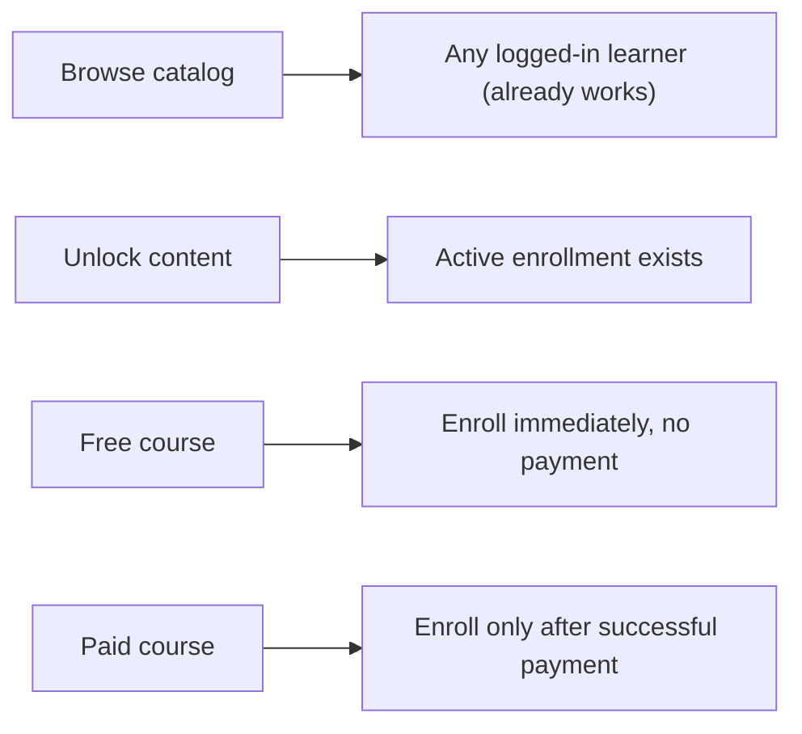
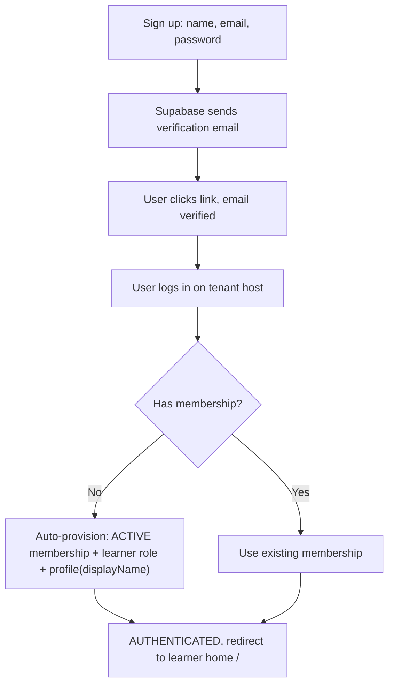
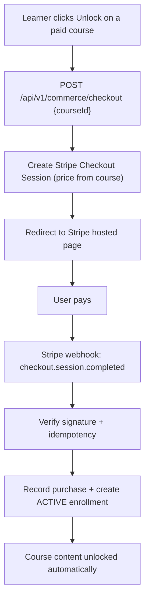

# Open Signup, Freemium Courses and Payments

## Implementation status (2026-08-13)

- Phase 1 Open signup — **done**
- Phase 2 Free vs paid / freemium — **done** (via courses.metadata_json)
- Phase 3 Live gateway checkout — **done** (PaymentProvider + Stripe adapter; PaymentOrder + `/api/v1/checkout/purchase` + Stripe webhook; no Purchase table / `/commerce/*`)

Execution roadmap for moving Atlas / Funded Beyond from an invite-only access model to an
open-signup freemium model:

1. Any visitor can sign up, verify email, and get an active learner account.
2. Logged-in learners see the full course catalog.
3. Free courses are immediately unlocked; paid courses are visible but locked.
4. Paying for a paid course unlocks it.

This is a cross-cutting plan (backend-led, with frontend touchpoints). It is kept as a single
document per request; the dominant work is backend (auth, membership, schema, commerce).

## Decisions locked in

- Scope: plan all three phases up front (including payment). Build phase by phase.
- Open signup: always-on for every tenant (no per-tenant toggle in v1).
- Membership timing: an active learner membership is created on the first successful login
  after the email is verified (not at signup time).
- Payment: Stripe Checkout + webhook; unlock is modeled as creating an enrollment.

## Core architectural principle

"Unlocked" always means "an active enrollment row exists." Free courses auto-create that
enrollment on self-enroll; paid courses create it only after a successful payment. Everything
downstream (lesson player, progress, certificates) already keys off enrollment, so those gates
do not change.



## Current state (what already exists)

Verified during exploration of the codebase:

- Catalog returns all `PUBLISHED` courses and does not filter by enrollment. See
  [backend/apps/api/src/server/courses/courses.repository.ts](backend/apps/api/src/server/courses/courses.repository.ts)
  (learner query filters only on `deleted_at is null` and `status = 'PUBLISHED'`).
- Browsing a course is separate from enrolling; course detail returns
  `enrollmentStatus: enrolled | not_enrolled` without blocking. See
  [backend/apps/api/src/server/courses/courses.service.ts](backend/apps/api/src/server/courses/courses.service.ts).
- Lesson content is gated on active enrollment. See
  [backend/apps/api/src/server/lessons/lessons.service.ts](backend/apps/api/src/server/lessons/lessons.service.ts)
  (`lessonEnrollmentRequired()`).
- Self-enroll API exists: `POST /api/v1/enrollments`. See
  [backend/apps/api/src/server/enrollments/enrollments.service.ts](backend/apps/api/src/server/enrollments/enrollments.service.ts)
  (`enrollCurrentMemberInCourse`).
- `learner` role already has `course.read`, `enrollment.read`, `enrollment.create`. See
  [backend/packages/access/src/seed/role-permission-matrix.ts](backend/packages/access/src/seed/role-permission-matrix.ts).
- Default accepted role constant is `learner`. See
  [backend/packages/access/src/seed/tenant-system-roles.ts](backend/packages/access/src/seed/tenant-system-roles.ts)
  (`DEFAULT_ACCEPTED_MEMBER_ROLE`).

### Gaps to close

1. Signup creates only a Supabase user + `auth_principals` row; no tenant membership, so a
   user without an invite gets `NO_ACTIVE_MEMBERSHIP`. See
   [backend/apps/api/src/app/api/v1/public/auth/signup/route.ts](backend/apps/api/src/app/api/v1/public/auth/signup/route.ts)
   and
   [backend/packages/domain/identity/src/services/public-auth-ui.service.ts](backend/packages/domain/identity/src/services/public-auth-ui.service.ts).
2. No free/paid concept on courses: the `Course` model has no `access_tier`, `price_cents`,
   or `currency`. See [backend/prisma/schema.prisma](backend/prisma/schema.prisma).
3. No payment integration anywhere in the codebase (no Stripe/commerce/checkout).
4. `displayName` is collected at signup but never persisted. See
   [frontend/apps/web/src/app/(auth)/signup/\_actions/signup-action.ts](<frontend/apps/web/src/app/(auth)/signup/_actions/signup-action.ts>).

---

## Phase 1 - Open signup to instant learner access

Goal: any visitor can sign up, verify email, log in, and land on the learner dashboard with
full catalog access. After this phase, users can freely enroll in any published course
(pricing is introduced in Phase 2).

### Flow



### Changes

1. New service `ensureSelfServiceLearnerMembership` in the membership package, modeled on
   `ensurePlatformSuperAdminTenantAccess` in
   [backend/packages/membership/src/platform-super-admin-tenant-access.ts](backend/packages/membership/src/platform-super-admin-tenant-access.ts):
   - Idempotent upsert of an `ACTIVE` membership for `(tenantId, authPrincipalId)`.
   - Calls existing `assignDefaultLearnerRole` from
     [backend/packages/access/src/seed/seed-user-roles.ts](backend/packages/access/src/seed/seed-user-roles.ts).
   - Creates the member profile with the saved `displayName` via
     [backend/packages/membership/src/member-profile.repository.ts](backend/packages/membership/src/member-profile.repository.ts).
2. Login route: after a successful `signed_in` with no membership, call the new service, then
   re-resolve membership so `buildPublicAuthResponse` returns `AUTHENTICATED` (redirect `/`)
   instead of `NO_ACTIVE_MEMBERSHIP`. See
   [backend/apps/api/src/app/api/v1/public/auth/login/route.ts](backend/apps/api/src/app/api/v1/public/auth/login/route.ts).
3. Signup route: when Supabase returns an immediate session (verification disabled, e.g. dev),
   provision the membership too. When verification is required, do nothing yet; membership is
   created on first login. See
   [backend/apps/api/src/app/api/v1/public/auth/signup/route.ts](backend/apps/api/src/app/api/v1/public/auth/signup/route.ts).
4. Persist `displayName`: stash it on the `auth_principals` row at signup and consume it when
   the membership/profile is created. See
   [backend/packages/auth/src/auth-principal.repository.ts](backend/packages/auth/src/auth-principal.repository.ts)
   (`upsertAuthPrincipal`).
5. Frontend signup action: on `EMAIL_VERIFICATION_REQUIRED` keep the "check your email"
   screen; on `AUTHENTICATED` redirect to `/`. See
   [frontend/apps/web/src/app/(auth)/signup/\_actions/signup-action.ts](<frontend/apps/web/src/app/(auth)/signup/_actions/signup-action.ts>).

### Result

Users can sign up, verify, log in, see the learner dashboard, browse the full catalog, and
freely enroll in any published course.

---

## Phase 2 - Free vs paid course tiers (visible but locked)

Goal: paid courses appear in the catalog with a price and a lock; their lessons stay locked
until purchase. No real payment yet (the Unlock action can be "coming soon" until Phase 3).

### Data model

> Implementation decision (Phase 2 build): pricing is stored inside the existing
> `courses.metadata_json` under the top-level keys `accessTier` (`"FREE" | "PAID"`),
> `priceCents` (int) and `currency` (3-letter), rather than adding dedicated columns. This
> matches how every other course marketing/config attribute is already stored (`level`,
> `stage`, `certificate`, `coverKey`, `tags.studioAccess`), avoids a stateful DB migration,
> and keeps the change fully reversible. Courses without an explicit tier are treated as
> `FREE`, so existing content stays unlocked. The reader/normalizer is `readCoursePricing()`
> in `courses.repository.ts`. Phase 3 can promote these to typed columns later if querying by
> price becomes necessary.

Original (columns-based) design, kept for reference, in
[backend/prisma/schema.prisma](backend/prisma/schema.prisma):

```prisma
enum CourseAccessTier {
  FREE
  PAID
}

model Course {
  // ...existing fields...
  access_tier CourseAccessTier @default(FREE)
  price_cents Int?
  currency    String?          @db.VarChar(3)
}
```

### Changes

1. Catalog query selects `access_tier`, `price_cents`, `currency` and continues to return all
   published courses (no filtering). See
   [backend/apps/api/src/server/courses/courses.repository.ts](backend/apps/api/src/server/courses/courses.repository.ts).
2. Enroll gate in `enrollCurrentMemberInCourse`: `FREE` enrolls as today; `PAID` without a
   purchase is rejected with a typed `PAYMENT_REQUIRED` error (HTTP 402, `coursePurchaseRequired()`).
   Already-enrolled learners keep access. See
   [backend/apps/api/src/server/enrollments/enrollments.service.ts](backend/apps/api/src/server/enrollments/enrollments.service.ts).
3. Catalog UI in
   [frontend/apps/web/src/app/courses](frontend/apps/web/src/app/courses): free shows
   "Enroll free"; paid + not owned shows a lock, formatted price, and "Unlock"; paid + owned
   shows the normal continue state. Course card lives at the catalog feature.
4. Course detail page surfaces pricing and, when locked, an "Unlock for <price>" CTA that is
   disabled with a "Purchasing will be available soon" note (real checkout lands in Phase 3).
5. Optional preview lessons (allow `isPreview` lessons to render without enrollment): deferred.
   No lesson-gate change was made in this build; lessons remain gated by enrollment.
6. Studio authoring: tier (`accessTier`) + price + currency fields added to the course settings
   form, persisted via `buildMetadataPatch` into `metadata_json`. The existing
   `tags.studioAccess` mode in
   [frontend/apps/web/src/features/studio/courses/course-access-settings.ts](frontend/apps/web/src/features/studio/courses/course-access-settings.ts)
   is left untouched (it controls a separate enrollment-access concern).

### Result

Paid courses are visible, previewable, and locked. Free courses are unlocked on self-enroll.

---

## Phase 3 - Payment to unlock

Goal: a learner pays for a paid course and it unlocks (an enrollment is created).

Recommendation: Stripe Checkout + webhook. No card data touches our servers.



### New Commerce module

1. Schema (Prisma) in [backend/prisma/schema.prisma](backend/prisma/schema.prisma):

```prisma
model Purchase {
  id                       String   @id @db.Uuid
  tenant_id                String   @db.Uuid
  membership_id            String   @db.Uuid
  course_id                String   @db.Uuid
  amount_cents             Int
  currency                 String   @db.VarChar(3)
  status                   String   // pending | paid | refunded | failed
  stripe_session_id        String?
  stripe_payment_intent_id String?
  created_at               DateTime @default(now()) @db.Timestamptz(6)
  updated_at               DateTime @updatedAt @db.Timestamptz(6)

  @@unique([stripe_session_id])
  @@index([tenant_id, membership_id, course_id])
  @@map("purchases")
}
```

2. Routes:
   - `POST /api/v1/commerce/checkout` - authenticated learner; creates a Stripe session for a
     paid course; price is read from the DB course, never from the client.
   - `POST /api/v1/commerce/webhook` - public, Stripe-signature-verified, idempotent; on
     `checkout.session.completed` mark the `Purchase` paid and create the enrollment via the
     existing enrollment insert.
3. Tenant config: Stripe keys via env to start (single platform account with `tenant_id`
   metadata). Stripe Connect per academy is a later option.
4. Unlock equals enrollment: the webhook calls the existing enrollment insert; no new gating
   code is needed because the lesson player already unlocks on enrollment.
5. Refund handling (later): webhook `charge.refunded` cancels the enrollment and marks the
   purchase refunded.

### Result

Full freemium loop: discover, sign up, free now / paid on purchase, unlock.

---

## Cross-cutting concerns

- Multi-tenant RLS: all new tables (`Purchase`) carry `tenant_id` and run through
  `withTenantTx`. Membership auto-provision runs in tenant scope.
- Migrations: Prisma migrations, all additive with backfilled defaults (`FREE`), zero
  downtime. Follow the migration best-practices rule.
- Idempotency: membership provisioning is an upsert; the Stripe webhook dedupes on
  `stripe_session_id`.
- Security: webhook signature verification; price read from the DB course, not the client; no
  client-supplied `tenantId` (existing `rejectClientTenantId`).
- Abuse / open signup: always-on signup means production should require email verification and
  add basic rate limiting on the signup route (note for later, not blocking).

## Testing

- Unit: provisioning service idempotency; enroll gate behavior by tier.
- Integration: signup -> login -> membership created; paid enroll rejected without purchase;
  webhook -> enrollment created. Extend
  [tests/api/public-auth-signup.post.test.ts](tests/api/public-auth-signup.post.test.ts)
  and the enrollments integration tests.
- E2E: full journey (sign up, verify, browse, enroll free, attempt paid, pay, unlock).

## Suggested build order

1. Phase 1 - small, high impact; validates the real-user experience. Ship first.
2. Phase 2 - schema + UI; paid courses locked with "Unlock - coming soon".
3. Phase 3 - Commerce + Stripe; turns on real payments.

Each phase is independently shippable and reversible.

## Open decisions for Phase 3 (deferred until that phase)

- Stripe account model: one platform account (tenant metadata) vs Stripe Connect per academy.
- Pricing type: one-time per course (assumed) vs subscriptions / bundles.
- Currency: single currency to start vs multi-currency.
