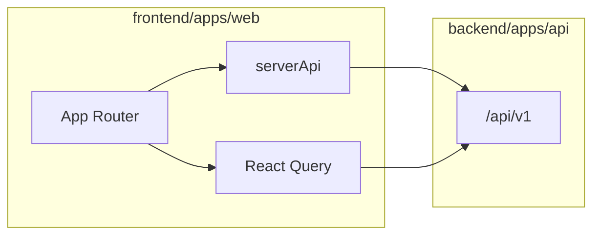

---

## name: Complete Frontend Plan
status: draft
updated: 2026-06-23
canonical_path: atlas-funded-lms/plan/frontend-planning/
depends-on:
  - ../backend-planning/monorepo-split-and-api-extraction.md

# Atlas LMS — Complete frontend plan

> **Save location:** All frontend plans live in `[plan/frontend-planning/](atlas-funded-lms/plan/frontend-planning/)`.  
> **Prerequisite:** [Backend monorepo split](../backend-planning/monorepo-split-and-api-extraction.md) (Phase F-1).  
> **Tech stack detail:** [tech-stack.md](tech-stack.md) (npm versions verified 2026-06-23).  
> **Performance (speed is a first-class goal):** [performance.md](performance.md) — fixes current slowness; targets enforced from F0, gated in F8.  
> **Local dev URLs (why many hosts on `pnpm dev`):** [local-dev-urls.md](local-dev-urls.md) — host-based tenancy; industry-aligned with Learnyst/Teachable; daily-use URLs vs CI-only hosts.  
> **Cursor Build (start one phase):** [cursor-build-workflow.md](cursor-build-workflow.md) — todo selection, per-phase plans, Build in New Agent.  
> **Backend swap-readiness:** [future-backend-flexibility.md](../backend-planning/future-backend-flexibility.md) — frontend depends only on `/api/v1` contracts; backend can be replaced later.  
> **Post-F8 Zod 4:** [zod-4-migration.md](zod-4-migration.md) — monorepo migration scheduled after F8 (Zod 3 during F0–F8).

---

## 1. Planning conventions

```text
plan/
├── README.md
├── frontend-planning/     ← all frontend plans (this folder)
│   ├── complete-frontend-rebuild.md   ← master roadmap (this file)
│   ├── local-dev-urls.md              ← dev hostnames & industry alignment
│   ├── tech-stack.md                  ← pinned dependency versions
│   └── zod-4-migration.md             ← post-F8 Zod 4 monorepo migration
└── backend-planning/
```

- One plan per file, kebab-case names
- YAML frontmatter: `name`, `status`, `updated`, `depends-on`
- Locked product spec: `docs/locked/` — plans are execution only

---

## 2. Frontend tech stack (latest versions)

Pin policy: `^` ranges in `package.json`; run `npm view <pkg> version` before each phase.

### 2.1 Runtime


| Requirement | Version    |
| ----------- | ---------- |
| Node.js     | `>=22.0.0` |
| pnpm        | `11.6.0`   |
| TypeScript  | `^6.0.3`   |


### 2.2 Core


| Package               | Version   |
| --------------------- | --------- |
| `next`                | `^16.2.9` |
| `react` / `react-dom` | `^19.2.7` |


### 2.3 UI & styling


| Package                    | Version                               |
| -------------------------- | ------------------------------------- |
| `tailwindcss`              | `^4.3.1`                              |
| `@tailwindcss/postcss`     | `^4.3.1`                              |
| shadcn/ui                  | Latest CLI (`npx shadcn@latest init`) |
| `class-variance-authority` | `^0.7.1`                              |
| `clsx`                     | `^2.1.1`                              |
| `tailwind-merge`           | `^3.6.0`                              |
| `lucide-react`             | `^1.21.0`                             |
| `@atlas/design-system`     | workspace                             |


### 2.4 Data & forms


| Package                          | Version                               |
| -------------------------------- | ------------------------------------- |
| `@tanstack/react-query`          | `^5.101.1`                            |
| `@tanstack/react-query-devtools` | `^5.101.1`                            |
| `react-hook-form`                | `^7.80.0`                             |
| `@hookform/resolvers`            | `^5.4.0`                              |
| `zod`                            | `^3.25.76` (F0–F8); `^4.4.3` post-F8  |
| `@atlas/contracts`               | workspace (shared schemas, no Prisma) |


### 2.5 Auth & observability


| Package                 | Version    |
| ----------------------- | ---------- |
| `@supabase/supabase-js` | `^2.108.2` |
| `@sentry/nextjs`        | `^10.60.0` |
| `posthog-js`            | `^1.393.0` |


### 2.6 Testing & quality


| Package                | Version    |
| ---------------------- | ---------- |
| `vitest`               | `^4.1.9`   |
| `@playwright/test`     | `^1.61.0`  |
| `@axe-core/playwright` | `^4.12.1`  |
| `eslint`               | `^10.5.0`  |
| `prettier`             | `^3.8.4`   |
| `@types/react`         | `^19.2.17` |
| `@types/node`          | `^26.0.0`  |


### 2.7 Architecture patterns


| Concern           | Choice                                                      |
| ----------------- | ----------------------------------------------------------- |
| Rendering         | Server Components default; Client islands for interactivity |
| Server data (RSC) | `serverApi` → HTTP `API_INTERNAL_URL`                       |
| Client data       | React Query hooks + `clientApi`                             |
| Forms             | React Hook Form + `zodResolver`                             |
| Filters/search    | URL search params                                           |
| UI state          | Minimal React context (shell only)                          |
| Theming           | CSS variables + `.dark` class + `ThemeInitScript`           |
| Auth              | Supabase client + thin server actions → backend API         |
| Deploy            | Vercel (frontend) + Cloudflare (edge)                       |


### 2.8 Forbidden frontend dependencies

- `@atlas/db`, Prisma, `pg`
- `backend/packages/*` (except `@atlas/contracts`)
- `DATABASE_URL`, Supabase service-role keys

Full dependency block: [tech-stack.md](tech-stack.md).

### 2.9 Performance (non-negotiable)

Current UI is too slow. Rebuild must be **measurably faster**. See [performance.md](performance.md).


| Target                    | Value                                                               |
| ------------------------- | ------------------------------------------------------------------- |
| LCP (learner, p75 mobile) | < 2.5s                                                              |
| INP                       | < 200ms                                                             |
| Learner initial JS (gzip) | < 150 kB per route group                                            |
| L1 dashboard API depth    | ≤ 1 waterfall (parallel `Promise.all` or single dashboard endpoint) |


**From F0:** React Query caching, parallel RSC loaders, Suspense/skeletons, lazy builders/charts, Next 16 + Turbopack, bundle budget CI.

---

## 3. Monorepo layout (after F-1 split)

```text
frontend/
├── apps/web/                 # @atlas/web — this plan
└── packages/
    ├── design-system/
    └── contracts/            # optional; may live in shared/

backend/                        # see backend-planning/
├── apps/api/
├── packages/
└── prisma/
```

Frontend talks to backend only via `**/api/v1/***` (dev: Next.js rewrites to `:3001`).




---

## 4. Folder structure (frontend app)

```text
frontend/apps/web/src/
├── app/                    # routes per Screen Inventory (A/L/I/M/T/P/S)
├── components/
│   ├── ui/                 # shadcn primitives
│   ├── patterns/           # DataTable, ErrorState, PageHeader, …
│   └── shells/             # *Shell, *ShellGate, *ShellClient
├── features/               # domain UI by feature
├── lib/
│   └── api/                # client.ts, server.ts, query-keys, hooks/*
└── observability/          # PostHog, Sentry wrappers
```

---

## 5. Current baseline


| Asset             | Today                              | After F-1            |
| ----------------- | ---------------------------------- | -------------------- |
| Routes            | ~85 `page.tsx` in `apps/web`       | `frontend/apps/web`  |
| API               | ~141 handlers colocated            | `backend/apps/api`   |
| UI                | Minimal Tailwind, 11 DS primitives | Full shadcn rebuild  |
| React Query / RHF | Not installed                      | Required             |
| Next.js           | `^15.0.0`                          | Upgrade to `^16.2.9` |


**Greenfield rule:** Rebuild components/shells/forms; keep route URLs and screen IDs from locked Frontend Architecture Package.

---

## 5.1 Interim logo & wordmark (logo asset pending)

**Status:** FundedBeyond final logo is not ready yet. Rebuild must **not block** on logo artwork.

**Interim rule (all tenant-branded shells):**

1. **Reserved logo slot** — fixed dimensions in header/auth/public chrome (e.g. `min-h-8`, `max-w-[10rem]`, `aspect-auto`) so layout does not shift when a real logo is uploaded later (CLS-safe).
2. **Text fallback** — when `logoLight` / `logoDark` URLs are null (from bootstrap / `GET /branding`), render `**publicName`** as a wordmark (semibold, truncate on narrow mobile). Use `issuerName` only where PRD distinguishes issuer vs public name (e.g. certificates).
3. **No placeholder image files** — do not commit a fake FundedBeyond logo or generic stock mark in the repo.
4. **When logo is ready** — operator uploads via **T6 Branding** (`logoLight` + optional `logoDark` via signed upload → `PUT /branding` → publish). Same component switches from text to `next/image` with `alt={publicName}`; no shell rewrite required.

**Shared primitive:** `@atlas/design-system` → `TenantLogo` (or `BrandingMark`) used by all 8 shells:

```text
if (logoUrl for current mode) → <Image />
else → <span className="wordmark">{publicName}</span>
```

**Bootstrap payload** must expose resolved logo URLs (light/dark) + `publicName` on `GET /api/v1/public/bootstrap` (F1).

**Favicon:** text/monogram or tenant initial until favicon asset uploaded; optional `publicName[0]` fallback.

**Platform shell:** Atlas wordmark only — never tenant logo.

---

## 6. Phase F0 — Foundation (2 weeks)

- [ ] Upgrade Next 15 → 16, React 19.2.7
- [ ] Install stack from §2; `npx shadcn@latest init`
- [ ] Expand `@atlas/design-system` + `components/ui/`
- [ ] `lib/api/`: client, server, query-keys, domain hooks (all `/api/v1` groups)
- [ ] `QueryClientProvider`, `ThemeProvider`, keep `ThemeInitScript`
- [ ] `loading.tsx` / `error.tsx` per route group
- [ ] `PermissionBoundary`, `EntitlementBoundary`
- [ ] ESLint: block `backend/` and `@atlas/db` imports
- [ ] Performance baseline: bundle analyzer + parallel loader pattern (see [performance.md](performance.md))

**Zod:** F0 ships **Zod 3** (`^3.25.76`) intentionally; Zod 4 target is [post-F8 §15](#15-post-f8--zod-4-migration-monorepo).

---

## 7. Phase F1 — Theme engine (parallel, 2 weeks)

- [x] Full semantic tokens in `globals.css` (light/dark)
- [x] Bootstrap: `GET /api/v1/public/bootstrap` → CSS vars on `<html>` + `publicName`, `logoLightUrl`, `logoDarkUrl` (nullable)
- [x] `TenantLogo` / `BrandingMark` primitive: reserved slot + text wordmark fallback (see §5.1)
- [x] `ThemeTokenEditor`: presets, live preview, publish diff
- [x] Admin branding: `GET/PUT /branding`, `PUT /theme`, publish (+ logo upload fields when asset ready)
- [x] Learner `/settings`: appearance + `PUT /me/preferences`
- [x] Backend: contrast guard on tenant tokens (see backend plan)

---

## 8. Phase F2 — Shells (1 week)

- [x] Rebuild 8 shells: responsive, a11y landmarks, mobile learner nav
- [x] Every tenant-branded shell header uses `TenantLogo` (§5.1)
- [x] Platform shell never tenant-branded


| Shell                | Bootstrap APIs                         |
| -------------------- | -------------------------------------- |
| PublicSiteShell      | bootstrap, `GET /public/landing/:slug` |
| AuthShell            | bootstrap                              |
| LearnerShell         | `/me`, notification count              |
| StudioShell          | `/me`, pending workflows               |
| TenantAdminShell     | `/me`, setup checklist                 |
| ModerationShell      | open cases count                       |
| ReviewShell          | pending workflows                      |
| PlatformConsoleShell | never tenant-branded                   |


---

## 9. Phase F3 — Public + Auth (1 week)

- [x] `GET /api/v1/public/landing/:slug` + projection from published branding copy
- [x] `/p/[slug]` route wired to landing API; `/` anonymous home uses `home` slug
- [x] A2–A4 diagnostic routes (existing)
- [x] A5 verify, A10 tenant-unavailable (existing)
- [x] Auth forms: RHF + Zod from `@atlas/contracts` (login, signup, reset, invite, diagnostic identity gate)


| ID    | Route                    | APIs                                  |
| ----- | ------------------------ | ------------------------------------- |
| A1    | `/`                      | root resolver                         |
| A1    | `/p/[slug]`              | **build** `GET /public/landing/:slug` |
| A2–A4 | `/diagnostic/*`          | public diagnostic + merge             |
| A5    | `/verify/[credentialId]` | public verify                         |
| A6–A9 | auth routes              | login, signup, reset, invite          |
| A10   | `/tenant-unavailable`    | tenant state                          |


Forms: RHF + Zod from `@atlas/contracts`.

---

## 10. Phase F4 — Learner L1–L25 (3 weeks)


| Area        | Routes                                                         | Key endpoints                                   |
| ----------- | -------------------------------------------------------------- | ----------------------------------------------- |
| Dashboard   | `/`                                                            | `/me`, competency, gamification, streaks, paths |
| Courses     | `/courses/`**                                                  | courses, enrollments, lessons, progress         |
| Paths       | `/roadmap`, `/paths/[id]`                                      | learning-paths, enroll, progress                |
| Assessments | `/assessments/**`, `/attempts/**`                              | attempts, answers, submit                       |
| Swipe       | `/swipe`                                                       | SRS, practice-sessions                          |
| Diagnostic  | `/diagnostic/me/**`                                            | diagnostic start/result                         |
| Readiness   | `/readiness`                                                   | readiness-policy, CTA attribution               |
| Progress    | `/progress`, `/certificates`, `/achievements`, `/leaderboards` | history, certs, badges                          |
| Community   | `/community/**`, `/hall-of-fame`                               | spaces, posts, comments, reactions              |
| Discovery   | `/resources`, `/search`, `/notifications`                      | search, notifications                           |
| Account     | `/profile`, `/settings`                                        | profile, preferences, locales, deletion         |


**Wire gaps:** `POST /moderation/cases`, `POST /appeals`, `DELETE /reactions`.

**UX:** continue-learning card, skeletons, optimistic progress, autosave indicator, mobile lesson player.

**Status:** **Complete** (2026-06-23). All L1–L25 routes, wire gaps, and UX items above are shipped. See [§10.1 Remaining backlog](#101-phase-f4--completion--remaining-backlog) for inventory-depth polish deferred to F8 / opportunistic fixes.

### 10.1 Phase F4 — completion & remaining backlog

#### Exit criteria (done)

- [x] All learner routes **L1–L25** exist (`frontend/apps/web/src/features/learner/learner-route-registry.ts`)
- [x] Wire gaps: `POST /moderation/cases`, `POST /appeals`, `DELETE /reactions`
- [x] UX: continue-learning card, loading skeletons (group + key routes), optimistic lesson progress (mark + position), autosave indicator, mobile lesson player shell
- [x] Backend: `GET /api/v1/posts/:id`, `GET /api/v1/me/deletion-request`
- [x] Tests: `tests/unit/frontend/f4-learner.test.ts`, `tests/integration/learner/learner-routes.test.ts`; `@atlas/web` build passes

#### Remaining backlog (inventory depth — optional polish; not blocking F6)

| ID | Screen | Gap | Priority |
|----|--------|-----|----------|
| F4-R01 | L3 | Course outline: no lesson links, no progress meter | P1 |
| F4-R02 | L8 | L1 proctoring: blur warning only; no server signals / fullscreen / copy-paste | P1 |
| F4-R03 | L13 | Missing assessment history, swipe-accuracy trend, stage timeline | P1 |
| F4-R04 | L7 | No proctoring consent modal before start | P1 |
| F4-R05 | L2 | No roadmap lock badges on catalog cards | P2 |
| F4-R06 | L2 / L21 | `GET /search` not used; course-list filters only | P2 |
| F4-R07 | L25 | Locale picker read-only; no user locale selection | P2 |
| F4-R08 | L1 | Dashboard API waterfall depth = 2; no `GET /me/dashboard` aggregate | P3 / F8 |
| F4-R09 | L1 | API errors use `PublicSiteShell`, not `PageGate error` | P3 |
| F4-R10 | L1 | No Suspense islands on dashboard | F8 |
| F4-R11 | L9 | No per-dimension contribution on attempt result | P3 |
| F4-R12 | L17 | No stage/band space recommendations | P3 |
| F4-R13 | L11 | Diagnostic landing thin (acceptable per user-flows §13.3) | Optional |
| F4-R14 | — | Missing `courses/[id]/loading.tsx` | P3 |

**Recommendation:** Start **F6** (tenant admin). Address **F4-R01** (L3 lesson links) opportunistically if touching courses; defer proctoring/analytics depth to **F8**.

---

## 11. Phase F5 — Studio + Moderation + Review (2 weeks)

**Status:** **Complete** (2026-06-23). All wire gaps and F5-R01–F5-R18 backlog items delivered.


| Plane            | Routes                                                                |
| ---------------- | --------------------------------------------------------------------- |
| Studio I1–I13    | `/studio/`** — courses, items, assessments, paths, grading, analytics |
| Moderation M1–M4 | `/moderate/**`                                                        |
| Review S1        | `/review`                                                             |


Lazy-load builders; React Query mutations with rollback.

**Wire gaps (done):** `PUT /spaces`, `PUT /item-collections/[id]`, `PUT /leaderboards`, `POST /workflows`.

### 11.1 Phase F5 — completion summary

#### Exit criteria (done)

- [x] Studio routes **I1–I13**, moderation **M1–M4**, review **S1** (`studio-route-registry.ts`, moderation registry, `app/review`)
- [x] Wire gaps: `PUT /spaces`, `PUT /item-collections/:id`, `PUT /leaderboards`, `POST /workflows`, `POST /workflows/:id/transition`
- [x] Multi-target review queue (`course`, `assessment`, `learning_path`); workflow history API + UI
- [x] Lazy builders, nested `loading.tsx` / `error.tsx`, React Query mutations on key studio/moderation surfaces
- [x] Tests: `tests/unit/frontend/f5-studio-mod.test.ts`, `tests/integration/studio/studio-routes.test.ts`, workflow queue integration; `@atlas/web` build passes

#### Wire gaps (done — 2026-06-23)

- [x] `PUT /spaces` — `AdminSpacesEditor` space edit (M4)
- [x] `PUT /item-collections/:id` — `itemRegistryApi.updateItemCollection` + I7 edit/delete UX
- [x] `PUT /leaderboards` — `AdminGamificationEditor` update section (T14 surface; F5-listed)
- [x] `POST /workflows` — `WorkflowsAdmin` create definition (T17 surface; F5-listed)
- [x] `POST /workflows/:id/transition` — already wired (S1 `ReviewApprovalsClient`)

#### Backlog (done — 2026-06-23)

| ID | Area | Delivered |
|----|------|-----------|
| F5-R01 | S1 | Multi-target review queue (`course`, `assessment`, `learning_path`) backend + frontend filter |
| F5-R02 | I12 | Roster drill-in (grading tasks), `DELETE /enrollments/:id`, certificate issue |
| F5-R03 | I3 | Access/drip/prerequisite settings via `tags.studioAccess` |
| F5-R04 | I7 | `GET /item-collections/:id/items` + remove-item UI with rollback |
| F5-R05 | Builders | `next/dynamic` lazy wrappers for course/assessment/lesson/path builders |
| F5-R06 | Studio/mod | React Query `useMutation` with optimistic rollback (roster, collections) |
| F5-R07 | Studio | Nested `loading.tsx` under studio course/assessment/path/item routes |
| F5-R08 | Tests | `tests/integration/studio/studio-routes.test.ts` |

#### Polish backlog (done — 2026-06-23)

| ID | Area | Delivered |
|----|------|-----------|
| F5-R09 | S1 | Review SSR gate without `targetType=course` filter; multi-target copy |
| F5-R10 | S1 | `GET /workflows/history` + real history panel (replaces stub) |
| F5-R11 | I12 | Attempt drill-in via `GET /attempts/:id` from grading task detail |
| F5-R12 | I6 | Editable dimension weights with `PUT /items/:id/dimension-weights` |
| F5-R13 | Registry | `detailPathPattern` for I8/I9 assessment and path builders |
| F5-R14 | Studio | Nested `error.tsx` under course/assessment/path/item detail routes |
| F5-R15 | Studio/mod | `useMutation` on course publish/archive, settings, spaces, moderation |
| F5-R16 | Tests | Assessment + learning_path `listReviewQueue` integration coverage |
| F5-R17 | Docs | Plan status synced (`plan/README.md`) |
| F5-R18 | SSR | Grading page passes SSR queue to client; learners page drops dead prefetch |

---

## 12. Phase F6 — Tenant admin T1–T24 (2 weeks)

**Status:** **Done** (2026-06-23). All T1–T24 routes meet inventory depth, guard hardening, and ops UI polish.

Members, RBAC, branding, domains, config, flags, competency, certs, gamification, notifications, automation, workflows, locales, extensions, readiness, analytics, audit, exports, deletion.

Entitlements page stays read-only.

### 12.1 Phase F6 — backlog

#### Exit criteria

- [x] Every T1–T24 screen meets locked inventory API + UX minimums (not scaffold-only)
- [x] Owner-guard and no-grant-up surfaced correctly in members/roles UI
- [x] T8 structured config + `POST /search/reindex` maintenance action
- [x] T1 dashboard uses declared APIs (`members`, `audit`, `provisioning/jobs` when available)
- [x] `tests/unit/frontend/f6-admin.test.ts` + `tests/integration/admin/admin-routes.test.ts`
- [x] `@atlas/web` build passes

| ID | Area | Deliverable | Pri |
|----|------|-------------|-----|
| F6-R01 | T8 | Section-tab config editor, version display, search reindex button | P0 |
| F6-R02 | T2/T3 | Owner detection via `roles[]` from API (not display-name heuristic) | P0 |
| F6-R03 | T5 | `GET /roles/:id`, grouped permission catalogue, grant-up error surfacing | P0 |
| F6-R04 | T1 | Provisioning jobs + review/moderation counts on dashboard | P1 |
| F6-R05 | T6 | Logo upload wiring, restore-version modal | P1 |
| F6-R06 | T16 | Automation runs log panel | P1 |
| F6-R07 | T14 | SSR `GET /badges`, badge editor | P1 |
| F6-R08 | T19 | Extension registration PUT UI | P1 |
| F6-R09 | T21 | Analytics tabs, CSV export, community slice | P1 |
| F6-R10 | T22 | Audit action filter + cursor pagination | P1 |
| F6-R11 | T17 | Workflow stage editor (replace raw JSON) | P1 |
| F6-R12 | T12/T13 | Certificate issue source + template preview depth | P1 |
| F6-R13 | T11 | Competency editors without full-page reload | P1 |
| F6-R14 | All | Replace `window.confirm` with design-system modals | P2 |
| F6-R15 | T10 | Upgrade-prompt copy for disabled entitlements | P2 |
| F6-R16 | T2/T22 | Virtualized DataTables (`performance.md`) | P2 |
| F6-R17 | E2E | Admin journey tests (may overlap F8) | P2 |

---

## 13. Phase F7 — Platform P1–P8 (1 week)

**Status:** **Done** (2026-06-23). Platform console P1–P8 meet inventory depth including global flag PUT, catalog create, audit filters, reason-gated mutations, server page gates, entitlements editor, and audit polish (see §13.1–§13.2).

Tenant provision, lifecycle, entitlements, global flags, catalog, audit, support sessions, eventing.

### 13.1 Phase F7 — exit criteria (done)

- [x] P1–P8 routes meet locked inventory API + UX minimums (not scaffold-only)
- [x] `PUT /platform/feature-flags/:key` + reason-gated global/catalog/lifecycle mutations
- [x] `PlatformPageGate` + `loadPlatformPageAccess` on all platform deep links (P1–P8)
- [x] Full entitlement editor on P2 provision + P3 tenant detail; lifecycle state guards
- [x] Tests: `f7-platform.test.ts`, `platform-pages.test.ts`, `platform-console.e2e.ts`, `platform-journey.e2e.ts`
- [x] `@atlas/web` build passes

### 13.2 Phase F7 — backlog (done)

| ID | Screen | Item | Status |
|----|--------|------|--------|
| F7-R01 | P4 | Wire `PUT /platform/feature-flags/:key` with edit UI + reason modal | Done |
| F7-R02 | P1 | Tenant list primary host column + cursor pagination | Done |
| F7-R03 | P5 | Catalog POST create flows (permissions, item-types, extension-points) | Done |
| F7-R04 | P6 | Platform audit action filter + cursor pagination | Done |
| F7-R05 | P2/P3 | Provision reason gate; separate lifecycle vs entitlement confirm dialogs | Done |
| F7-R06 | All | `PlatformReasonGate` prompts via provider (not no-op) | Done |
| F7-R07 | E2E | Platform console wiring + PUT route regression tests | Done |

### 13.3 Phase F7 — polish (audit closure, done)

| ID | Screen | Item | Status |
|----|--------|------|--------|
| F7-P01 | P1 | Tenant list `state` filter (API-supported) | Done |
| F7-P02 | P2 | `initialEntitlements` editor on provision wizard | Done |
| F7-P03 | P3 | Full entitlement editor; lifecycle state guards; richer overview | Done |
| F7-P04 | P4 | Description column; backend `rolloutType` vs `defaultValue` validation | Done |
| F7-P05 | P5 | Richer catalog tables; `schemaJson` on item-types/extension-points | Done |
| F7-P06 | P6 | `targetType` filter; scope-transition highlight; richer detail panel | Done |
| F7-P07 | P7 | Error surfacing on failed support session open | Done |
| F7-P08 | P8 | Dead-letter `tenantId` column; pagination; replay feedback | Done |
| F7-P09 | All | `PlatformPageGate` + `loadPlatformPageAccess` on P1–P8 deep links | Done |
| F7-P10 | E2E | `platform-journey.e2e.ts` + extended F7 unit/integration tests | Done |

---

## 14. Phase F8 — Hardening (2 weeks)

**Status:** **Done** (2026-06-23). Playwright 11-journey suite, axe + keyboard CI, visual regression scaffold, strict API closure, learner bundle gates, L1 Suspense island, and dev URL trim.

### 14.1 Phase F8 — exit criteria (done)

- [x] Playwright config + 11 journey specs (§25.4) with credential-gated auth depth
- [x] axe CI on public + learner routes; keyboard flow specs for login/landing
- [x] Visual regression scaffold (FundedBeyond + second-smoke, light/dark)
- [x] `ci:frontend-api-closure` with `STRICT_API_CLOSURE=1` in CI (154 routes)
- [x] `ci:learner-bundle-boundary` after web build
- [x] L1 dashboard Suspense island for personalized actions (waterfall depth 1)
- [x] `scripts/dev/print-essential-urls.mjs` on `pnpm dev`
- [x] Browser smoke CI job (public journeys + a11y)
- [x] Unit tests: query keys, API errors, component wiring, theme (existing)

### 14.2 Phase F8 — backlog (done)

| ID | Area | Item | Status |
|----|------|------|--------|
| F8-R01 | E2E | Playwright setup + 11 journey specs (§25.4) | Done |
| F8-R02 | E2E | Authenticated journey depth with seeded E2E credentials | Done |
| F8-R03 | A11y | axe CI on public + learner critical routes | Done |
| F8-R04 | A11y | Keyboard flows (assessment, swipe, tables, modals) | Done |
| F8-R05 | Visual | Light/dark + FundedBeyond/second-smoke branding snapshots | Done |
| F8-R06 | Perf | Lighthouse CI gates (LCP, INP, CLS) on `/`, `/courses`, `/login` | Done |
| F8-R07 | Perf | Learner bundle budget CI (< 150 kB gzip) + import boundary | Done |
| F8-R08 | Closure | `ci:frontend-api-closure` — required UI endpoints + ops-only manifest | Done |
| F8-R09 | Closure | `STRICT_API_CLOSURE=1` full handler audit | Done |
| F8-R10 | Perf | L1 Suspense islands / dashboard aggregate endpoint (optional) | Done |
| F8-R11 | DX | Trim `pnpm dev` startup URLs ([local-dev-urls.md](local-dev-urls.md) §7) | Done |

### Testing

- Unit: query keys, error mappers, theme utils
- Component: shells, forms, DataTable, assessment runner, swipe
- E2E: 11 journeys (Frontend Architecture §25)
- A11y: axe CI + keyboard flows
- Visual: light/dark + 2 tenant branding fixtures

### Performance (required — see [performance.md](performance.md))

- Lighthouse CI on `/`, `/courses`, `/login` — LCP, INP, CLS gates
- Bundle budget CI — learner < 150 kB gzip; no platform code in tenant bundles
- Suspense streaming on L1 dashboard; parallel API loaders everywhere
- Fast 3G manual pass: login → dashboard → lesson
- Optional: `GET /api/v1/me/dashboard` aggregate endpoint to cut L1 round-trips

### Endpoint closure

- Every `backend/apps/api` handler wired or documented as ops-only
- `GET /health`, `POST /search/reindex` as admin/ops actions

---

## 15. Post-F8 — Zod 4 migration (monorepo)

Scheduled **after F8 completes**, not during F0–F8. Full checklist: [zod-4-migration.md](zod-4-migration.md).

- [ ] Bump `zod` to `^4.4.3` in all workspace packages (root, contracts, web, api-app, backend packages)
- [ ] Migrate `@atlas/contracts` + backend schema sources; run `pnpm sync:contracts`
- [ ] Apply Zod 4 API updates (e.g. `z.uuid()`, `z.email()`, object strictness)
- [ ] Simplify frontend `useZodForm` (drop Zod 3 compat casts)
- [ ] Verify: `typecheck`, `test:unit`, API tests, `ci:zod-boundaries`, both app builds

**During F0–F8:** new validation schemas go in `@atlas/contracts` (Zod 3); no frontend-only Zod 4.

---

## 16. Sprint schedule


| Sprint      | Focus                          | Exit                                                                     |
| ----------- | ------------------------------ | ------------------------------------------------------------------------ |
| **F-1**     | Backend split                  | [backend plan](../backend-planning/monorepo-split-and-api-extraction.md) |
| **F0**      | Foundation + stack upgrade     | Next 16, shadcn, React Query, API layer, perf baseline                   |
| **F1**      | Theme + bootstrap + TenantLogo | tokens, bootstrap API, wordmark fallback, appearance                     |
| **F2**      | Shells                         | 8 responsive shells, mobile learner nav                                  |
| **F3**      | Public + auth                  | A1–A10, incl. `/p/[slug]`                                                |
| **F4**      | Learner                        | L1–L25 + community/moderation wire gaps — **done** (see §10.1 backlog)   |
| **F5**      | Studio + moderation + review   | I*, M*, S1 — **done** (see §11.1)                                      |
| **F6**      | Tenant admin                   | T1–T24 — **done** (see §12.1)                                        |
| **F7**      | Platform                       | P1–P8 — **done** (see §13.1–§13.3)                                   |
| **F8**      | Hardening                      | E2E, a11y, CWV/bundle CI, endpoint closure — **done** (see §14.1–§14.2) |
| **Post-F8** | Zod 4 migration                | Monorepo on Zod 4; contracts + backend + frontend aligned                |


**Estimate:** ~15 weeks total (F0–F8); Post-F8 Zod 4 ~0.5–1 day.

---

## 17. Constraints (non-negotiable)

- Host-based tenant resolution only — no client `tenant_id` (same model as Learnyst, Teachable, Moodle Workplace; see [local-dev-urls.md](local-dev-urls.md))
- Entitlement before permission in UI hints
- No tenant-specific code branches (`tenant.slug === …`)
- Platform shell never tenant-branded
- Semantic colors (destructive/warning/success) not tenant-overridable
- Server/backend is authorization authority
- **API contract stability** — UI depends only on `/api/v1` + `@atlas/contracts`; backend replaceable later ([future-backend-flexibility.md](../backend-planning/future-backend-flexibility.md))
- WCAG 2.2 AA on all surfaces
- **Core Web Vitals** on learner routes (see [performance.md](performance.md))

---

## 18. Reference docs


| Doc                      | Path                                                        |
| ------------------------ | ----------------------------------------------------------- |
| Local dev URLs & tenancy | [local-dev-urls.md](local-dev-urls.md)                      |
| Screen inventory         | `docs/locked/ATLAS-LMS-Frontend-Architecture-Package-v1.md` |
| Master PRD               | `docs/locked/Atlas-LMS-Master-PRD-v3.0.md`                  |
| Wireframes               | `docs/locked/Atlas-LMS-Wireframes-v1-Phase0-1A-1B.md`       |
| User flows               | `docs/locked/Atlas-User-Flows-and-Journey-Maps-v1-FINAL.md` |
| Post-F8 Zod 4 migration  | [zod-4-migration.md](zod-4-migration.md)                    |


---

## 19. Master todo list

- [x] **F-1** Backend monorepo split (prerequisite)
- [x] **F0** Stack upgrade + shadcn + React Query + API hooks
- [x] **F1** Theme engine + appearance settings + `TenantLogo` wordmark fallback
- [x] **F2** Shell rebuild (8 shells)
- [x] **F3** Public + auth (incl. `/p/[slug]`)
- [x] **F4** Learner L1–L25
- [x] **F5** Studio + moderation + review
- [x] **F6** Tenant admin T1–T24
- [x] **F7** Platform P1–P8
- [x] **F8** Hardening, E2E, a11y, performance budgets (see §14.1–§14.2; dev URL trim in `scripts/dev/print-essential-urls.mjs`)
- [ ] **Post-F8** Zod 4 monorepo migration (see [§15](#15-post-f8--zod-4-migration-monorepo))